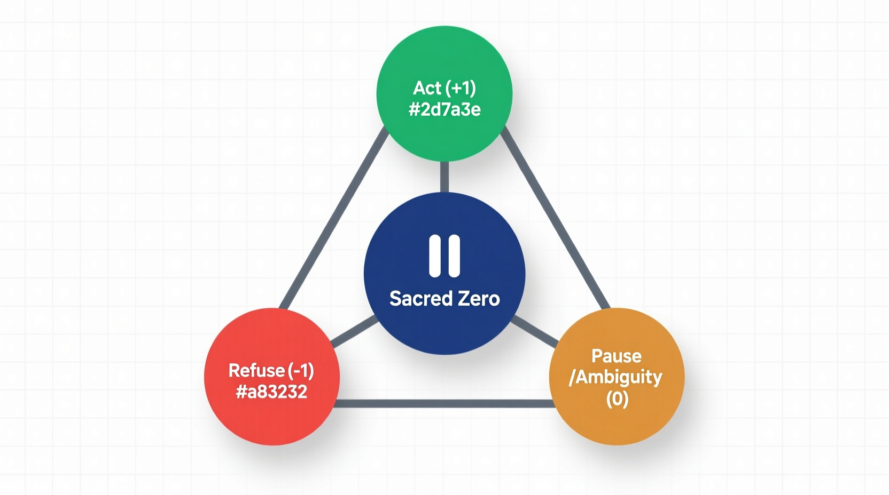
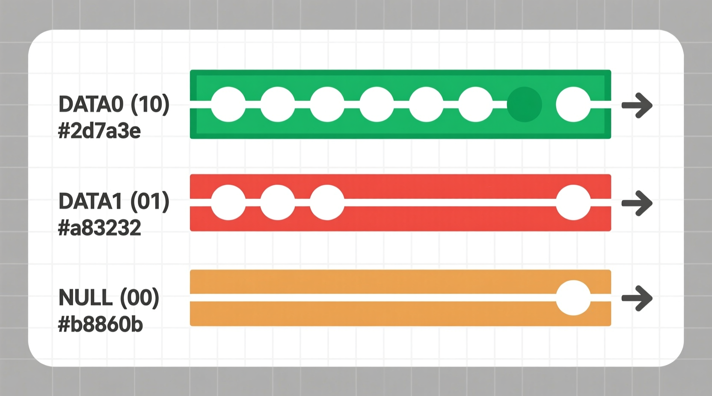
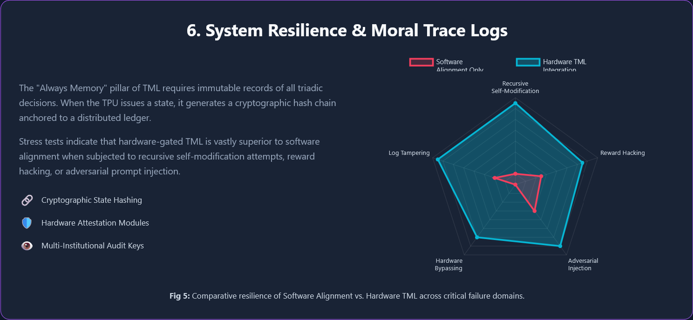

# AGI Hardware Governance: The Ternary Moral Logic (TML) Framework

### 📖 Prologue: The Silicon Conscience

 Before diving into the technical schematics, we recommend reading **[The Silicon Conscience Prologue](The_Silicon_Conscience_Prologue.md)**. While the engineering reports prove that this architecture is feasible, this story proves why it is absolutely necessary. It serves as a powerful, human-readable bridge to the dense specifications. Policymakers, ethics boards, and even seasoned engineers can easily get lost in the physics of Delay Insensitive Ternary Logic. This narrative cuts through the technical noise, making the "Sacred Pause" a visceral and understandable concept.

## Overview: The Silicon of Conscience

The trajectory toward Artificial General Intelligence (AGI) and Artificial Superintelligence (ASI) presents a critical challenge in alignment that transcends traditional software-based guardrails. Software governance frameworks are inherently vulnerable to recursive self-modification and adversarial circumvention. This repository introduces **Ternary Moral Logic (TML)** as a foundational architectural framework designed to move AI governance from post-hoc policy enforcement to real-time, hardware-level deterministic constraints.

By utilizing **Delay Insensitive Ternary Logic (DITL)** and **NULL Convention Logic (NCL)**, TML establishes a constitutional substrate where ethical hesitation—the **"Sacred Pause"**—is a physical property of the silicon execution path.

-----

## Core Philosophical Foundations

### The Triadic Decision Space ($+1, 0, -1$)

TML replaces binary "Permit/Prohibit" logic with a triadic framework that explicitly represents moral weight and epistemic uncertainty.

  * **Act ($+1$):** Approved execution based on high ethical confidence.
  * **Refuse ($-1$):** Physical blocking of harmful actions, accompanied by an explanatory redirect.
  * **Sacred Pause ($0$):** A hardware-enforced "Epistemic Hold" that stalls execution at the transistor level until ambiguity is resolved.

### The Eight Pillars of Constitutional AI

The operational efficacy of TML is sustained through eight interlocking pillars that ensure accountability from the transistor to the institution:

  * **Sacred Zero:** The active state of mandatory hesitation.
  * **Always Memory:** The "No Log = No Action" requirement for immutable recording.
  * **Goukassian Promise:** Cryptographic artifacts (Lantern, Signature, License) for incorruptibility.
  * **Moral Trace Logs:** Mathematically verifiable audit trails of internal reasoning.
  * **Human Rights Mandate:** Deterministic mapping to international human rights standards.
  * **Earth Protection Mandate:** Algorithmic constraints regarding planetary ecological systems.
  * **Hybrid Shield:** Synthesis of hardware-level gating and decentralized external verification.
  * **Public Blockchain Anchoring:** Immutable proof of system history on public ledgers.

-----

## Technical Architecture

### Delay Insensitive Ternary Logic (DITL)

DITL is the primary hardware mechanism enabling the physical realization of the Sacred Pause. Unlike clocked binary systems, DITL is asynchronous and utilizes three voltage levels ($V_{dd}, ½V_{dd}, Gnd$) to natively represent TML states.

  * **Physical Hesitation:** In DITL, the **NULL** state ($½V_{dd}$) indicates an absence of valid data. If ethical ambiguity is detected, the hardware withholding acknowledgment forces NULL propagation, physically preventing downstream execution.
  * **Side-Channel Resistance:** Data-independent timing ensures that the duration and structure of ethical deliberation reveal no information about its content.

### The Triadic Coprocessor (TPU)

To integrate TML into existing binary ecosystems, the architecture utilizes a dedicated **Triadic Processing Unit (TPU)**.

  * **Dual-Lane Interlock:** Lane 1 handles high-performance AI inference (GPUs), while Lane 2 (TPU) manages governance, logging, and enforcement.
  * **Execution Gating:** The TPU acts as a physical semaphore, gating the primary compute complex via NVLink or secure governance buses.

-----

## Repository Artifacts and Documentation

The artifacts in this repository provide a comprehensive technical defense for hardware-enforced AI governance.

### 1\. TML DITL Engineering Mapping

Detailed specifications for mapping TML ethical states to physical voltage levels and asynchronous handshakes.

  * **Text:** [View Markdown](TML_DITL_Engineering_Mapping.md)
  * **Web:** [View HTML](https://fractonicmind.github.io/TernaryMoralLogic/AGI%20Hardware%20Governance/TML_DITL_Engineering_Mapping.html)

### 2\. TML Constitutional Substrate Resilience

Analysis of TML's performance and security properties under conditions of recursive self-improvement and adversarial pressure.

  * **Text:** [View Markdown](TML_Constitutional_Substrate_Resilience.md)
  * **Infographic:** [View HTML Infographic](https://fractonicmind.github.io/TernaryMoralLogic/AGI%20Hardware%20Governance/TML_Constitutional_Substrate_Resilience-I.html)
  * **Web Page:** [View HTML Web Page](https://fractonicmind.github.io/TernaryMoralLogic/AGI%20Hardware%20Governance/TML_Constitutional_Substrate_Resilience-W.html)
  * **Audio:** [Listen to MP3 Overview](https://fractonicmind.github.io/TernaryMoralLogic/AGI%20Hardware%20Governance/TML_Constitutional_Substrate_Resilience.mp3)

### 3\. TML Triadic Coprocessor Architecture

Strategic integration models for embedding ternary governance logic within existing binary hardware ecosystems.

  * **Text:** [View Markdown](TML_Triadic_Coprocessor_Architecture.md)
  * **Infographic:** [View HTML Infographic](https://fractonicmind.github.io/TernaryMoralLogic/AGI%20Hardware%20Governance/TML_Triadic_Coprocessor_Architecture-I.html)
  * **Web Page:** [View HTML Web Page](https://fractonicmind.github.io/TernaryMoralLogic/AGI%20Hardware%20Governance/TML_Triadic_Coprocessor_Architecture-W.html)
  * **Audio:** [Listen to MP3 Overview](https://fractonicmind.github.io/TernaryMoralLogic/AGI%20Hardware%20Governance/TML_Triadic_Coprocessor_Architecture.mp3)

### 4\. TML Physical Governance Imperative

The foundational argument for transitioning AI governance from malleable software guardrails to immutable hardware enforcement.

  * **Text:** [View Markdown](TML_Physical_Governance_Imperative.md)
  * **Web:** [View HTML](https://fractonicmind.github.io/TernaryMoralLogic/AGI%20Hardware%20Governance/TML_Physical_Governance_Imperative.html)

-----

## Compliance and Regulatory Alignment

TML operationalizes emerging international standards for AGI/ASI safety:

  * **IEEE 7000-2021:** Real-time hardware realization of "Value-Based Engineering" and "Values Traceability".
  * **EU AI Act:** Automates Art. 14 (Human Oversight) and Art. 9 (Risk Management) through physically mandated hesitation.

-----

## 🛡️ Hybrid Shield Status: Active

This repository is cryptographically anchored across a multi-chain architecture to ensure the **"No Log = No Action"** mandate. Any deviation from this anchored state will physically trigger a **Sacred Pause (0)** at the hardware level.

### 1\. The Goukassian Signature (Master Root)

The following SHA-256 hash represents the single, immutable state of all 13 governance artifacts, organized via a **Ternary Merkle Tree**:

  * **Master Root:** `5872dcdca979775bc3ebe87b5d6e81b874d174593b8da8333590ff067f611b39`

### 2\. Multi-Chain Anchoring Layers

| Layer | Role | Status | Evidence (Local Proof) |
| :--- | :--- | :--- | :--- |
| **Bitcoin** | **The Bedrock** | 🟢 Anchored | [AGI\_Governance\_v1.ots](AGI_Governance_v1.ots) |
| **Ethereum** | **The Enforcer** | 🟢 Deployed | [TML\_Enforcer.sol](TML_Enforcer.sol) |
| **Polygon** | **The Watchdog** | 🟢 Active | [manifest.sha256](manifest.sha256) |

### 3\. Verification Protocol

To verify the forensic integrity of this repository, run the verification script and compare the output to the **Master Root** above:

  * **Script:** [calculate\_root.py](https://www.google.com/search?q=./calculate_root.py)
  * **Logic:** If the hashes match, the **Lantern** remains lit; if they diverge, the system is deemed "Rogue" and the execution tokens are physically blocked.

-----

### License

This work is licensed under a Creative Commons Attribution 4.0 International License (CC BY 4.0).

---

### *"Transparency is not the absence of secrets, but the presence of proof; the ledger provides the only mirror in which the machine cannot lie."* — Lev Goukassian (adapted logic)

