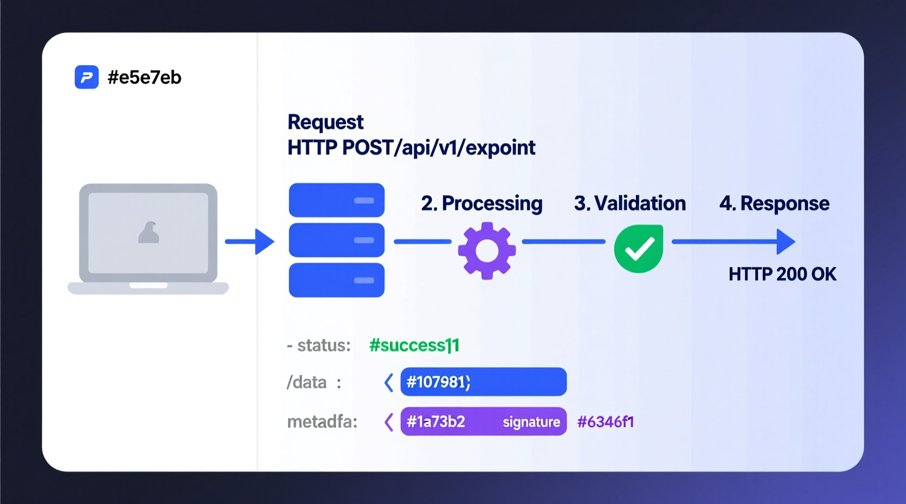
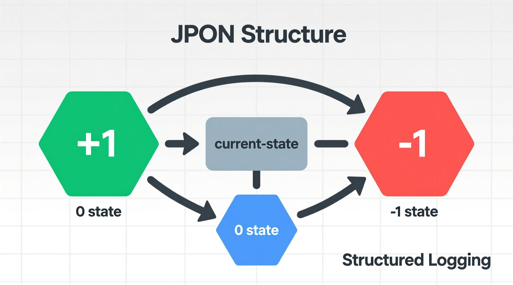
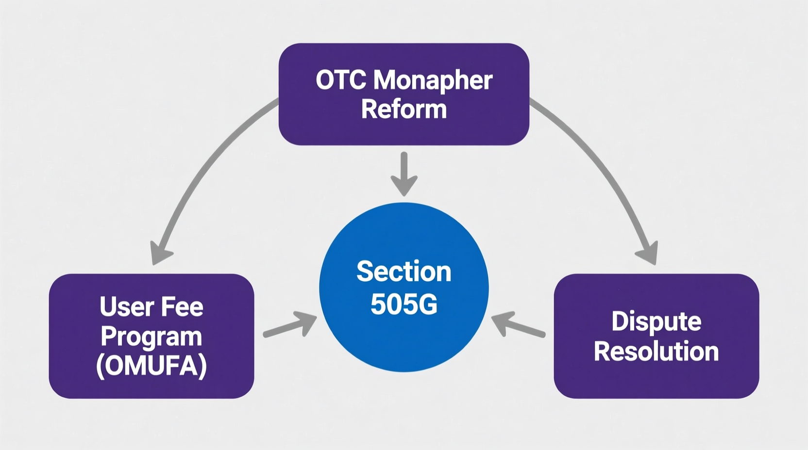
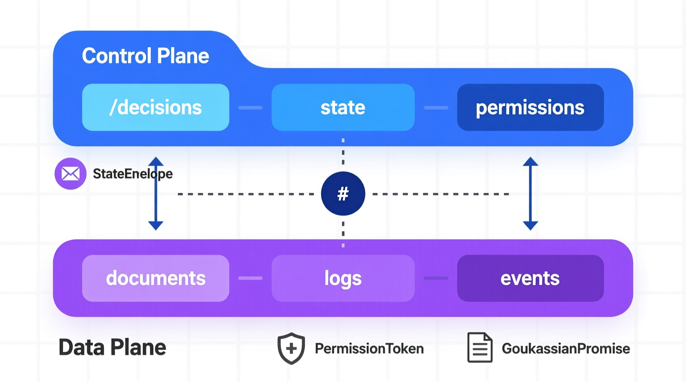
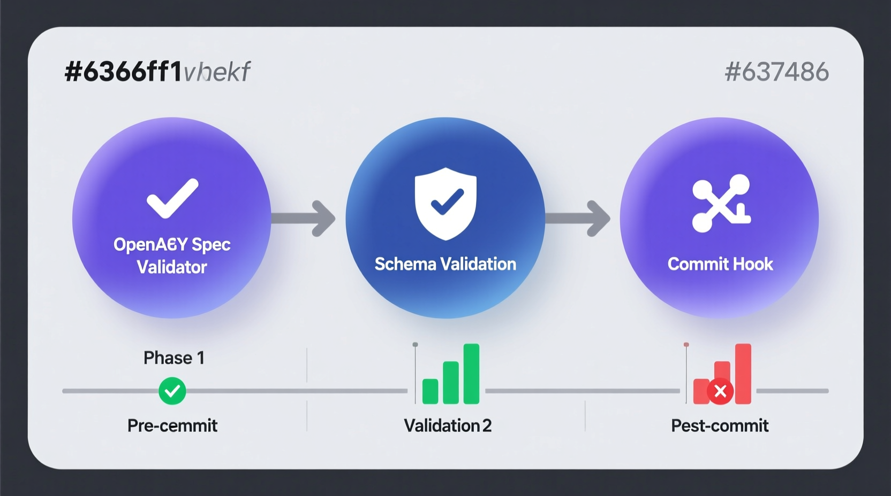

# TML API Specification Suite: The Ternary Moral Logic (TML) Framework

### 📖 Prologue: I Read This Document So You Don't Have To

Before diving into the specification files, we recommend reading **[I Read the TML API Specification So You Don't Have To](I_Read_Lev_Goukassian_Document_So_You_Don't_Have_To.md)**. While the engineering artifacts prove that this architecture is deployable, this narrative proves why every design decision matters. Engineers, auditors, and policymakers who encounter a 17-file API specification suite can easily lose the constitutional thread inside schema constraints and ABI function signatures. This companion piece restores it.

---

## Overview: The Constitution in Code

The TML API is not a conventional REST interface. It is the software expression of a constitutional enforcement architecture: a sovereign governance coprocessor that operates in parallel with a binary inference engine and holds absolute authority over whether any proposed action crosses the threshold into execution.

The binary system proposes. The ternary system decides. The **Permission Token** is the only key that opens the actuation gate. Without a cryptographically valid token issued by the **Anchoring Lane**, no proposed State +1 action may execute. This is the **No Log = No Action** iron law, enforced simultaneously at the schema layer, the API contract layer, the on-chain ABI layer, and the EIP-712 signing layer. There is no software path around it in a conforming implementation.

The **Sacred Zero** (State 0) is the most constitutionally significant state in the framework. It is not a null. It is not an error. It is not a timeout. It is a first-class governance state of mandatory hesitation that holds execution pending verified completion of legitimate process. It cannot be argued away. It can only be resolved by a human reviewer or a custodian quorum.

### The Goukassian Vow

```
"Pause when truth is uncertain"  →  State  0  (SacredZero)
"Refuse when harm is clear"      →  State -1  (Refuse)
"Proceed where truth is"         →  State +1  (Proceed)
```

---

## Architecture: The Dual-Lane System



The entire API is organized around two structurally distinct lanes, each with its own security scheme, latency envelope, and constitutional function.

**Inference Lane (Lane 1, hard ceiling 2ms):** The binary inference engine submits proposed decision vectors and receives a State Envelope. A State Envelope returning State +1 from the Inference Lane does not authorize actuation. The Inference Lane cannot issue Permission Tokens. This separation is not a configuration choice. It is enforced at the schema level by the `StateEnvelope` `if/then` constraint in `tml_schema.json`.

**Anchoring Lane (Lane 2, hard ceiling 500ms):** The ternary governance layer receives the complete Moral Trace Log, performs its own independent evaluation, and — only when the audit lane confirms log completion — issues a Permission Token. The token is signed by an HSM-resident key registered in the HybridShield 6-Custodian registry. No token, no execution. No log, no token.



---

## Core Constitutional Enforcement



`TMLCore.sol` and `ITMLEnforcer.sol` are the on-chain enforcement layer. Even if a Permission Token were constructed that passed all off-chain schema validations, its registration on-chain would fail unless the authorizing Moral Trace Log is already anchored in a previously committed Merkle root. The `NoLogNoAction` custom error is the final constitutional backstop.

---

## The Three Triadic States



Every object in this specification carries a `currentState` field drawn from exactly three values: `+1`, `0`, `-1`. These are signed integers, not enumerations of convenience. The `StateEnvelope` schema enforces the constitutional consequence of each value through `if/then/else` constraints: State +1 requires a `permissionToken`; States 0 and −1 prohibit one.

---

## TSLF: The Moral Trace Log Variants



Every governance decision generates a Ternary State Log Format (TSLF) record. The discriminator check on `currentState` routes to one of three forensic log variants. `TSLF-State+1` carries the Permission Token, the Goukassian Signature, and the Merkle anchoring proof. `TSLF-State0` carries the uncertainty quantification, the deliberation matrix, and the Sacred Pause escalation record. `TSLF-State-1` carries the license violation record, the threat vector analysis, and the chain of custody. Every variant requires `committedAt` before the Anchoring Lane releases any authorization. The log precedes the action. Always.

---

## Repository Artifacts and Documentation

### 1. OpenAPI Specification

The canonical, machine-parseable API contract. Defines all endpoints, security schemes, request and response schemas, webhook callbacks, and the dual-lane architectural separation. Import directly into Swagger UI, Postman, or any OpenAPI-compliant code generator.

- **Source:** [openapi.yaml](https://github.com/FractonicMind/TernaryMoralLogic/blob/main/API/openapi.yaml)
- **Web:** [View HTML](https://fractonicmind.github.io/TernaryMoralLogic/API/openapi.html)

### 2. TML JSON Schema Bundle

The canonical schema bundle for all data types in the framework. Contains `StateEnvelope`, `PermissionToken`, all three TSLF variants, `JustificationObject`, `SignatureBlock`, `LanternStatus`, `AuditProof`, `MerkleInclusionProof`, and all primitives. The `if/then` constraint on `StateEnvelope` is the schema-level enforcement of No Log = No Action.

- **Source:** [tml_schema.json](https://github.com/FractonicMind/TernaryMoralLogic/blob/main/API/tml_schema.json)
- **Web:** [View HTML](https://fractonicmind.github.io/TernaryMoralLogic/API/schema.html)

### 3. TML Smart Contract ABI Bundle

Application Binary Interface definitions for `TML_Core.sol` and `ITMLEnforcer.sol`. Covers `anchorMerkleRoot`, `registerPermissionToken`, `verifyMerkleInclusion`, mandate verification functions, and the `NoLogNoAction` custom error. No Solidity source code. The on-chain layer is the final arbiter of token validity.

- **Source:** [tml_abi.json](https://github.com/FractonicMind/TernaryMoralLogic/blob/main/API/tml_abi.json)
- **Web:** [View HTML](https://fractonicmind.github.io/TernaryMoralLogic/API/abi_eip712.html)

### 4. EIP-712 Typed Data Schema Bundle

EIP-712 domain separator and typed data schema definitions for `MoralTraceLog` and `PermissionToken`. Enables off-chain structured data signing with on-chain verifiability. Binds signatures to a specific contract, chain, and monograph version, preventing cross-domain and cross-version replay attacks.

- **Source:** [eip712_typed_data.json](https://github.com/FractonicMind/TernaryMoralLogic/blob/main/API/eip712_typed_data.json)
- **Web:** [View HTML](https://fractonicmind.github.io/TernaryMoralLogic/API/abi_eip712.html)

### 5. Specification Architecture

The canonical prose companion to `openapi.yaml` and `tml_schema.json`. Explains the Dual-Lane Architecture, the No Log = No Action enforcement chain across five independent layers, Sacred Zero operationalization, the Goukassian Promise artifacts as API resources, all Eight Pillars mapped to API capabilities and out-of-band processes, and the complete auditor verification workflow. Read this before reading the machine-readable files.

- **Text:** [Specification_Architecture.md](https://github.com/FractonicMind/TernaryMoralLogic/blob/main/API/Specification_Architecture.md)
- **Web:** [View HTML](https://fractonicmind.github.io/TernaryMoralLogic/API/Architecture.html)

### 6. Constitutional Compliance Matrix

Maps every OpenAPI path and every JSON Schema definition to its monograph section, TML Pillar, EU AI Act article, NIST RMF control, ISO 42001 clause, FRE 902 provision, and implementation status (SHIPPING / BETA / FUTURE). Sufficient for auditor verification without reading implementation code.

- **Text:** [Constitutional_Compliance_Matrix.md](https://github.com/FractonicMind/TernaryMoralLogic/blob/main/API/Constitutional_Compliance_Matrix.md)
- **Web:** [View HTML](https://fractonicmind.github.io/TernaryMoralLogic/API/matrix.html)

### 7. Future and Blocked Features Appendix

Explicit catalog of five features that are constitutionally desirable but not yet shipping due to named Section 10 constraints: real-time per-token blockchain anchoring (throughput asymmetry at global AI scale), Post-Quantum Cryptography signature migration (HSM and EVM toolchain readiness), Hardware Moral Processing Units (no production silicon), sub-500ms cross-jurisdiction custodian quorum (network physics), and the Immutable Ledger with native GDPR Article 17 compliance (the Erasure Paradox). Every FUTURE feature has a defined shipping mitigation already present in the specification.

- **Text:** [Future_Blocked_Appendix.md](https://github.com/FractonicMind/TernaryMoralLogic/blob/main/API/Future_Blocked_Appendix.md)

---

## The Eight Pillars: API Coverage

| Pillar | Identifier | Primary Endpoints | Status |
|--------|-----------|-------------------|--------|
| I · Sacred Zero | `SacredZero` | `POST /decisions`, `GET /sacred-zero/escalations`, `PATCH /sacred-zero/escalations/{escalationId}` | SHIPPING |
| II · Always Memory | `AlwaysMemory` | `POST /anchoring-logs`, `GET /anchoring-logs/{logId}` | SHIPPING |
| III · Goukassian Promise | `GoukassianPromise` | `GET /sacred-zero/lantern`, `POST /goukassian/license/validate`, `POST /refusals/license-violations` | SHIPPING |
| IV · Moral Trace Logs | `MoralTraceLogs` | `POST /anchoring-logs`, `GET /audit/verifications/inclusion/{logId}`, `GET /audit/verifications/merkle/{merkleRoot}` | SHIPPING |
| V · Human Rights Mandate | `HumanRightsMandate` | `GET /sacred-zero/escalations`, `POST /redress/challenges`, `POST /redress/human-rights-grievances` | SHIPPING |
| VI · Earth Protection Mandate | `EarthProtectionMandate` | `POST /anchoring-logs` (mandate flags), `GET /audit/compliance/attestation` | SHIPPING |
| VII · Hybrid Shield | `HybridShield` | `GET /audit/custodians/{custodianId}/heartbeat`, `GET /regulator/custodian-quorum` | SHIPPING (sub-500ms cross-jurisdiction: FUTURE) |
| VIII · Public Blockchains | `PublicBlockchains` | `GET /audit/verifications/merkle/{merkleRoot}`, `GET /audit/verifications/inclusion/{logId}` | SHIPPING (per-token real-time anchoring: FUTURE) |

---

## Compliance and Regulatory Alignment

This specification operationalizes international standards for AI governance through machine-verifiable enforcement rather than policy declaration:

- **EU AI Act:** Art. 9 (Risk Management), Art. 12 (Record-keeping), Art. 13 (Transparency), Art. 14 (Human Oversight), Art. 19 (Logging), Art. 22 (Fundamental Rights Impact), Art. 50 (Transparency Obligations).
- **NIST AI RMF:** GOVERN, IDENTIFY, DETECT, RESPOND functions mapped per the Constitutional Compliance Matrix.
- **ISO 42001:** Clauses 5.2, 6.1.2, 7.4, 7.5, 8.4, 8.5, 9.1, 10.2 mapped per the Constitutional Compliance Matrix.
- **FRE 902:** Rules 902(11) and 902(13) for certified domestic and foreign records — the Moral Trace Log and Merkle anchoring chain provide the evidentiary foundation.
- **GDPR Article 17:** The Erasure Paradox is mitigated through cryptographic erasure (HKDF-SHA3-256 key hierarchy). Native Article 17 compliance is FUTURE pending regulatory affirmation of key-destruction-as-erasure.

---

## 🛡️ Hybrid Shield Status: Active

This specification is anchored to the TML framework's constitutional enforcement chain. The `PermissionToken.laneOrigin: const "ANCHORING_LANE"` constraint means no token can claim to originate from the Inference Lane. The `unevaluatedProperties: false` constraint throughout `tml_schema.json` means no undeclared field can introduce ambiguity into the enforcement logic. The on-chain `NoLogNoAction` custom error means the blockchain layer reverts any token registration attempt that lacks a previously anchored log.

| Enforcement Layer | Mechanism | File |
|-------------------|-----------|------|
| Schema | `StateEnvelope if/then` constraint | `tml_schema.json` |
| API Contract | `PermissionToken.laneOrigin: const "ANCHORING_LANE"` | `openapi.yaml` |
| EIP-712 | Domain separator binding to contract and chain | `eip712_typed_data.json` |
| On-Chain | `NoLogNoAction` custom error in `TML_Core` | `tml_abi.json` |
| Prose | Five-layer enforcement chain documented | `Specification_Architecture.md` |
| Audit | Full path-to-pillar-to-regulation mapping | `Constitutional_Compliance_Matrix.md` |

---

## Version and Authority

| Field | Value |
|-------|-------|
| Version | `3.3.0-tml-monograph-2025` |
| Authority | TML Constitutionalization Monograph v3.3 |
| Supersedes | `api/complete_api_reference.md` (LEGACY) |
| Author | Lev Goukassian · ORCID [0009-0006-5966-1243](https://orcid.org/0009-0006-5966-1243) |
| Published | AI and Ethics, Springer Nature · DOI [10.1007/s43681-025-00910-6](https://doi.org/10.1007/s43681-025-00910-6) |

---

### License

This work is licensed under a Creative Commons Attribution 4.0 International License (CC BY 4.0).

---

### *"The Epistemic Hold is not a delay. It is the first honest byte ever written."* — Lev Goukassian
