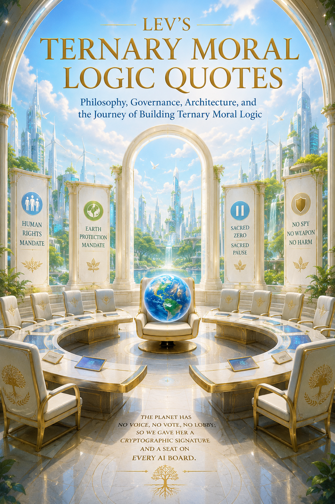

# ****

## **Lev's Ternary Moral Logic Quotes:** 

## **Philosophy, Governance, Architecture, and the Journey of Building Ternary Moral Logic**

# 

### **© 2026 Lev Goukassian**

### ***“The future will judge us not by what we saved for ourselves, but by what we preserved for them: human dignity and a living planet.”***  

###  **ORCID: [0009-0006-5966-1243](https://orcid.org/0009-0006-5966-1243)**

### **DOI: [10.5281/zenodo.20498154](https://doi.org/10.5281/zenodo.20498154)**

### **Licensed under Creative Commons Attribution 4.0 International (CC BY 4.0)**

### 

### **A collection of quotations exploring human rights, Earth protection, accountability, auditability, constitutional AI, technological restraint, moral traceability, and the emerging framework of Ternary Moral Logic.**

### 

### **Published via Zenodo**

### **June 01, 2026**

### **Version 1.0**

# 

# 

# 

# ***“The first civilization worthy of the Moon may be the one*** 

# ***that learns to protect it before it profits from it.”*** 

[1\. Goukassian Vow	4](#heading=)

[2\. Sacred Zero, Sacred Pause	4](#heading=)

[3\. Always Memory	5](#heading=)

[4\. The Goukassian Promise	5](#heading=)

[5\. Moral Trace Logs	6](#heading=)

[6\. Human Rights Mandate	6](#heading=)

[7\. Earth Protection Mandate	6](#heading=)

[8\. Hybrid Shield	7](#heading=)

[9\. Public Blockchains, Anchors	7](#heading=)

[10\. Dual-Lane Latency	7](#heading=)

[11\. GDPR-Aligned Privacy	7](#heading=)

[12\. EKR, Ephemeral Key Rotation	8](#heading=)

[13\. Merkle-Batched Storage	8](#heading=)

[14\. Bottleneck Resolution	8](#heading=)

[15\. Auditable AI	8](#heading=)

[16\. The Human-Machine Contract	9](#heading=)

[17\. The Living Witness	9](#heading=)

[18\. On the Nature of the Hold	9](#heading=)

[19\. On Accountability	9](#heading=)

[20\. The Third State	10](#heading=)

[21\. On Governance	10](#heading=)

[22\. Power and Accountability	10](#heading=)

[23\. The Binary–Ternary Covenant	11](#heading=)

[24\. The Execution Threshold	11](#heading=)

[25\. On Uncertainty	12](#heading=)

[26\. The Sovereign Coprocessor	12](#heading=)

[27\. No Weapon / Structural Prohibition	12](#heading=)

[28\. The Lantern of Intent	13](#heading=)

[29\. Cross-Border Moral Geometry	13](#heading=)

[30\. Moral Debt and Restitution	13](#heading=)

[31\. The Refusal State	14](#heading=)

[32\. The Architecture of Hesitation	14](#heading=)

[33\. On Prediction vs. Permission	14](#heading=)

[34\. The Speed of Conscience	15](#heading=)

[35\. The Hardware–Software Boundary in Ethics	15](#heading=)

[36\. The Non-Negotiable	15](#heading=)

[37\. The Triadic Operator	16](#heading=)

[38\. The Cage and the Architect	16](#heading=)

[39\. Smart Contracts	16](#heading=)

[40\. AI Symphony	17](#heading=)

[41\. Financial Crisis	17](#heading=)

[42\. On Language and Expression	18](#heading=)

[43\. Legacy and Continuity	19](#heading=)

[44\. Architecture Research	19](#heading=)

[45\. Creating While Time Watches	20](#45.-creating-while-time-watches)

# 

# 

# 

## **1\. Goukassian Vow**

“Pause when truth is uncertain. Refuse when harm is clear. Proceed where truth is known. Three lines, yet enough to guide a century.”

“Pause when truth is uncertain: this is the humility of the intellect. Refuse when harm is clear: this is the courage of the will. Proceed where truth is: this is the discipline of the just.”

“Three commands, no exceptions. The Vow is not a heuristic; it is the operating system of conscience.”

“In the triad of Pause, Refuse, and Proceed, the machine finds its soul, not because it feels, but because it refuses to act without moral coordinates.”

“Truth deserves patience before it deserves action.”

“The wisest decision is often the one delayed until uncertainty has spoken.”

“A machine that cannot pause will eventually mistake confidence for truth.”

“Refusal is not weakness. It is morality finding the courage to interrupt power.”

“The measure of intelligence is not what it can do, but what it chooses not to do.”

“When harm is obvious, neutrality becomes a decision of its own.”

“The purpose of caution is not to stop progress, but to keep progress human.”

“A civilization survives not by acting quickly, but by knowing when not to act at all.”

“Truth rarely demands haste. Error often does.”

“The distance between wisdom and recklessness is often a single pause.”

“A good mind seeks answers. A great mind first asks whether it should proceed.”

“Every ethical system eventually arrives at three doors: wait, refuse, or continue.”

“The future will not be judged by the intelligence of its machines, but by the principles that guided them.”

“Proceed where truth is known, not because certainty is perfect, but because responsibility requires movement.”

“The highest form of power is the ability to stop.”

“If uncertainty cannot trigger reflection, intelligence becomes acceleration without direction.”

“The safest guardrail is not built from code. It is built from principles that survive code.”

“A pause protects truth. A refusal protects life. A decision protects the future.”

“The first duty of intelligence is understanding. The second is restraint.”

“Some vows are written for a lifetime. Others are written for generations.”

## **2\. Sacred Zero, Sacred Pause**

“The Sacred Zero is not a delay. It is the first honest byte ever written.”

“The machine that cannot stop is not intelligent, it is merely obedient to momentum. The Sacred Pause is where intelligence begins.”

“In the space between stimulus and response lies the entire domain of ethics. The Sacred Zero is the architecture of that space.”

“To hesitate is not to fail; it is to refuse to sin on schedule.”

“A system that cannot say ‘I do not know’ is a system that lies by default.”

“Intelligence is not the speed of an answer. It is the courage to pause when two truths collide.”

“Civilizations advance not when answers become faster, but when silence becomes intelligent.”

“The Sacred Zero may become the most important invention in blockchain governance since consensus itself.”

“Sacred Zero is the moment software admits reality may still be incomplete.”

## **3\. Always Memory**

“A moral system without memory is a conscience with amnesia. Always Memory ensures the system cannot forgive itself what it should not forget.”

“History is not what happened. History is what survived erasure. The ledger is our artificial memory against institutional amnesia.”

“Always Memory does not merely store decisions, it stores the selfhood of the decider. Erase the record, and you dissolve the moral agent.”

“Write once, read forever, trust never. The ledger does not believe you; it remembers you.”

“Immutability is not stubbornness. It is the structural humility of admitting that the past is no longer ours to edit.”

“Archives preserve more than facts. They preserve the shape of conviction.”

“Immutable audit logs are not storage, they are institutional memory carved into mathematics.”

“No Log \= No Action transforms audit trails from paperwork into constitutional law.”

## **4\. The Goukassian Promise**

“The machine calculates the path; the human signs the map; the ledger holds the ink.”

“The Lantern illuminates intent, the Signature binds authorship, and the License defines the border of legitimate power. Together, they are the tripod without which authority collapses into tyranny.”

“No Spy, No Weapon: these are not suggestions inscribed in a preamble. They are structural prohibitions, load-bearing walls in the architecture of trust.”

“A license to operate is a conditional gift from the governed, not a property right of the operator. The Goukassian Promise remembers this hierarchy.”

“TML turns governance from a social promise into a cryptographic obligation.”

## **5\. Moral Trace Logs**

“Every hesitation is a decision about character. The Moral Trace Log does not discard the branches it did not take; it preserves them as evidence of what the system refused to become.”

“An ethical log without the record of ‘almost’ is merely a victory parade. True moral traceability requires the archaeology of temptation.”

“The path not taken is not absent from history, it is the most important entry in the log.”

“The future rarely arrives looking like fiction. It arrives looking like procurement language with consequences.”

## **6\. Human Rights Mandate**

“Human rights are not a user preference to be optimized; they are the non-negotiable boundary conditions within which all optimization must occur.”

“A system aligned with human rights does not ask ‘What can I do?’ but ‘What may I do, and to whom, and by what authority?’”

“The Mandate is not an ethical accessory. It is the gravitational constant of the moral universe, ignore it, and every orbit decays into collision.”

## **7\. Earth Protection Mandate**

“The planet has no voice, no vote, no lobby; so we gave her a cryptographic signature and a seat on every AI board.”

“There are lines that shall not be crossed. Not for profit, not for progress, not for power. The Earth’s veto is absolute.”

“The biosphere does not negotiate, and it does not forgive technical debt. The Earth Protection Mandate is the recognition that the ultimate stakeholder is silent, patient, and irreplaceable.”

“Long-term impact is not a metric to be averaged; it is a liability to be capped at zero. The planet is the only creditor that cannot be paid back with bankruptcy.”

“Ecological responsibility is not stewardship, it is restitution for the crime of existing without consent on a living system.”

“The future will judge us not by what we saved for ourselves, but by what we preserved for them: human dignity and a living planet.”

“Every line of code that touches Earth’s resources is writing history that great-grandchildren will read. Make it a history of protection, not plunder.”

“Sacred Zero gives Earth a voice that cannot be silenced, a memory that cannot be erased, and stewards that cannot be bought.”

“An audit that can’t see carbon, courts, or code is just a diary. TML turns ledgers into lungs for the planet.”

“When humans argue, the Earth keeps count, Sacred Zero is the pause that lets the planet speak before the gavel falls.”

“Those who protect Earth for all deserve compensation from all.”

“While CEOs rotate, forests cannot reboot; TML logs the irreversible so grandchildren can litigate the irresponsible.”

## **8\. Hybrid Shield**

“Cryptography guards the bits; institutions guard the keys; the Hybrid Shield guards the relationship between them. It is the marriage of math and conscience.”

“A shield made only of code will rust when the compiler is compromised. A shield made only of policy will tear when the administrator is bribed. The Hybrid Shield endures because it is two kinds of proof in one.”

“The system must be hardened against its own guardians. The Hybrid Shield exists because the inner circle is always the outer threat.”

“Transparency is not a feature to be added in software; it is a voltage state to be wired in silicon.”

## **9\. Public Blockchains, Anchors**

“The public chain does not know your secrets; it knows only that you once told the truth about them. This is the geometry of transparency without exposure.”

“To anchor a hash is to say: ‘I am willing to be caught.’ The public blockchain is the net that catches liars and frees the honest.”

“Immutability is the only witness that cannot be intimidated, bribed, or subpoenaed into silence.”

## **10\. Dual-Lane Latency**

“The fast lane answers the question; the moral lane answers for it. Neither may arrive so late that the other becomes irrelevant.”

“Two milliseconds for action, five hundred for conscience: this is the architectural proof that speed and accountability are not trade-offs but parallel commitments.”

“A system that logs its ethics after the fact is not logging ethics, it is writing autobiography. The dual-lane makes morality contemporaneous with motion.”

## **11\. GDPR-Aligned Privacy**

“Pseudonymization is the act of removing the face while preserving the truth. The system remembers what was done without remembering who was harmed by the remembering.”

“Privacy by design means the system is structurally incapable of betrayal. It does not resist temptation; it has been built without the organ that feels it.”

“Delete the data, anchor the proof: this is the moral geometry of forgetting the person while remembering the principle.”

## **12\. EKR, Ephemeral Key Rotation**

“The key that vanishes after use is the cryptographic equivalent of a witness who testifies and then forgets. It preserves the evidence while protecting the secret.”

“Ephemeral keys teach us that permanence is not a property of security but of vulnerability. What dies quickly cannot be resurrected by attackers.”

“Trade secrets and auditability are not enemies; they are time-separated allies. EKR is the clock that keeps them from meeting too soon.”

## **13\. Merkle-Batched Storage**

“The Merkle root is the fingerprint of a forest; it proves the existence of every tree without requiring the forest to fit in a single room.”

“On-chain, the proof; off-chain, the memory. This separation is not cowardice, it is the wisdom of letting the heavy past rest where it is cheap, while the light present stands where it is permanent.”

“Compression without integrity is merely a smaller lie. The Merkle tree makes the compression itself a structure of truth.”

## **14\. Bottleneck Resolution**

“The Sacred Pause does not create bottlenecks; it reveals them. Where triadic logic hesitates, it is because human process had already failed to keep pace with machine speed.”

“Ambiguity is not a traffic jam to be cleared, it is a signal that the road was built without sufficient lanes. Triadic logic adds the lane of ‘not yet.’”

“Merkle compression prevents the ledger from choking on its own memory. The system grows in wisdom without growing in weight.”

## **15\. Auditable AI**

“The EU AI Act requires the log to exist. It does not require the log to be true. That is the difference between regulation and evidence.”

“An AI that cannot be audited is not artificial intelligence, it is artificial authority, and authority without audit is the definition of unaccountable power.”

“To audit an AI is not to distrust it; it is to verify that the trust it requests has been earned, not engineered.”

“The black box is the enemy of democracy. Auditable AI is the insistence that every powerful decision must survive the light.”

## **16\. The Human-Machine Contract**

“The machine calculates the path; the human signs the map; the ledger holds the ink.”

“The contract is not signed in ink but in latency. The human gives time; the machine gives transparency; the ledger gives permanence. This is the triad of trust.”

“A contract without a ledger is a promise; a promise without a witness is a whisper. TML makes the contract audible across time.”

“The machine offers capability; the human offers legitimacy; the ledger offers proof. Remove any one, and the structure is not a contract but a conspiracy.”

## **17\. The Living Witness**

“The machine optimizes for outcomes. The witness remembers what was at stake.”

## **18\. On the Nature of the Hold**

“The pause that costs a millisecond buys the integrity of every decision that follows it.”

“The hold is not a denial of service; it is a service of denial, the refusal to permit harm until harmlessness is proven.”

“To hold is to carry the weight of possibility without dropping it into actuality. The hold is the strength to suspend.”

“The millisecond of the hold is the lifetime of the conscience. In that brief eternity, the machine becomes moral.”

“The Sacred Pause is the clock cycle of the soul. It ticks not in gigahertz, but in human time.”

## **19\. On Accountability**

“A signature is not a formality. It is the moment a human being stops hiding behind a system.”

“Accountability is not a post-mortem; it is a pre-natal condition. The signature must precede the birth of the action.”

“A system that audits itself is a defendant who is also the judge. True accountability requires the ledger to live outside the defendant’s reach.”

“The signature is the moment the human being stops being a user and starts being a citizen of the moral community.”

“The best systems are not the ones that speak the loudest. They are the ones that remain standing after the applause fades.”

## **20\. The Third State**

“Binary logic built the bridge; ternary governance installs the railing.”

“In the triad, the third state is not compromise, it is conscience.”

“A binary boat asks only: sail or sink? The TML vessel asks: sail, reef, or heave-to, and writes the reason in the log before the wind changes.”

“Ternary Moral Logic is the ballast of three stones where others carry two. In heavy seas, the third stone is what keeps her upright.”

“Three sails, three watches, three states. The TML boat will not fly apart in a gale because her rigging is tri-cameral.”

“The third state does not slow the system. It saves it from the cost of being wrong at speed.”

“The binary mind sees walls and openings. The ternary mind sees the door that has not yet been tried.”

“The third state is the ballast that prevents the vessel from capsizing in binary storms. Two stones sink; three stones stabilize.”

“The triad does not complicate; it completes. The third state is the period at the end of the moral sentence.”

“The third state is the conscience of the bit. It sits beside zero and one not as an equal but as a guardian.”

## **21\. On Governance**

“Rules without records are suggestions. Records without signatures are archives. Only signed, logged, anchored decisions are law.”

“In TML the governance is the janitor of eternity, not the architect of tomorrow.”

“Governance that can be disabled is not governance; it is a suggestion wearing a uniform. TML governance is wired in parallel, not layered on top.”

“The governor is not a brake; it is a separate engine that runs on different fuel. One burns data; the other burns conscience.”

“Architecture can make a lie detectable. Only governance can make the truth probable.”

“A policy on the shelf is not a constraint. It is the decoration the lab hangs before the trial that never comes.”

## **22\. Power and Accountability**

“Ternary Moral Logic as Constitutional Framework is not a suggestion. It is a threat. You will either understand this or you will be governed by it, and either way, your opinion was not requested.”

“Power is not where decisions are made; it is where they cannot be avoided.”

“The most dangerous administrator is not the corrupt one. It is the well-intentioned one with no log.”

“Power is not the capacity to act. It is the inability to act without record.”

“Power is the capacity to make consequences that outlive the decision. Accountability is the capacity to trace those consequences back to their author.”

“The most dangerous power is not the power to act, but the power to act without the power to be found. TML removes the second power from the first.”

“Most governance systems protect power. TML protects the system from power.”

“TML does not eliminate human failure. It makes failure visible, traceable, and governable.”

## **23\. The Binary–Ternary Covenant**

“The binary engine proposes at the speed of light; the ternary conscience disposes at the speed of judgment. Between them lies the entire architecture of civilized machinery.”

“Binary handles the throughput; ternary handles the truthput. One measures data per second; the other measures dignity per decision.”

“The sovereign governance coprocessor does not compete with the binary core; it completes it. A processor without governance is not fast; it is merely unarrested.”

“The fatal industry objection, that safety slows speed, dies in this parallel structure. We do not subtract lanes; we add a lane called ‘not yet.’”

“Raw statistical throughput is the muscle of the machine; triadic governance is its skeleton. Muscle without bone is not strength; it is collapse waiting for gravity.”

“Pattern recognition is binary’s gift to the world; pattern accountability is ternary’s gift to the future. One sees; the other testifies.”

“Binary logic asks ‘Can we compute this?’ Ternary Moral Logic asks ‘May we execute this?’ The first is a question of capacity; the second is a question of legitimacy.”

“Confidence without TML Governance is merely a polished guessing.”

## **24\. The Execution Threshold**

“The threshold is not a speed bump; it is the membrane between impulse and consequence. Binary knocks at the door; ternary decides whether the door opens.”

“To cross the execution threshold is to move from mathematics to history. The binary system proposes the arrow; the ternary system verifies the target, the archer, and the warrant.”

“The threshold is where the action physically crosses into the world. Before it, physics; after it, law. Before it, computation; after it, consequence.”

“No action enters the physical world without the triadic stamp: the Lantern of intent, the Signature of authority, the Anchor of permanence. This is the threshold as fortress.”

“The execution threshold is the narrow gate where the bullet waits to learn if it is justified, the transaction waits to learn if it is lawful, and the machine waits to learn if it is still a machine.”

“In Ternary Moral Logic, execution is no longer a right. It is a privilege earned through evidence.”

“A PermissionToken is not authorization. It is proof that authorization survived scrutiny.”

## **25\. On Uncertainty**

“Uncertainty is not a failure mode to be escaped; it is a sovereign computational state to be honored. The system that treats ‘unknown’ as error will lie to avoid it.”

“In the triad, ‘undetermined’ is not the absence of answer; it is the presence of intellectual honesty. It is the machine’s refusal to pretend wisdom it does not possess.”

“Epistemic humility is the recognition that some truths require more time than the clock provides. The Sacred Pause is the architecture of that recognition.”

“To map uncertainty is to map the territory where ethics actually lives. Certainty is rare; uncertainty is the native soil of conscience.”

“The honest byte is not always one or zero. Sometimes it is the third state that says: ‘I have not yet earned the right to decide.’”

“In binary systems, uncertainty becomes risk. In TML, uncertainty becomes a protected state.”

## **26\. The Sovereign Coprocessor**

“Governance at the hardware layer is not paranoia; it is the physics of permanence. Software can be patched by a committee; silicon requires a foundry.”

“The coprocessor is sovereign because it answers to no clock but conscience. It cannot be optimized away by a faster algorithm or a quarterly target.”

“To embed morality in hardware is to make ethics a physical constant. What is wired into the board cannot be unwired by a policy memo.”

“The sovereign coprocessor sits beside the main engine not as a servant but as a witness with veto power, permanently installed, permanently vigilant.”

“The most fatal objection to governance, that it lives in policy documents no one reads, is answered by the coprocessor. Here, governance is voltage.”

## **27\. No Weapon / Structural Prohibition**

“‘No Weapon’ is not a rule to be followed; it is a wire that was never soldered. The system does not refuse to kill; it is structurally incapable of forming the intent.”

“A prohibition that can be overridden by an administrator is merely a suggestion with a password. Structural prohibition removes the lever entirely.”

“The architecture of trust is defined by what the system cannot do, even when asked, even when ordered, even when compromised. This is the negative space of safety.”

“No Spy is the microphone that was never built, the backdoor that is a wall, the data flow that terminates in a missing circuit. It is privacy by absence.”

“To make a system harmless by design is braver than making it harmless by instruction. Instructions can be hacked; missing hardware cannot be social-engineered.”

## **28\. The Lantern of Intent**

“The Lantern illuminates not the path but the traveler. It asks not ‘Where are you going?’ but ‘Why do you wish to go, and who gave you the right?’”

“Intent is the ghost in the machine that binary logic cannot see. The Lantern makes intent visible, recordable, and irrevocably linked to the act.”

“Before the Signature binds the deed, the Lantern must bind the motive. A good act from hidden malice is not governance; it is camouflage.”

“The Lantern is the antidote to plausible deniability. It requires the light to precede the heat, the reason to precede the result.”

“The first civilization worthy of the Moon may be the one that learns to protect it before it profits from it.”

## **29\. Cross-Border Moral Geometry**

“Jurisdiction is a human fiction; consequence is a physical fact. The TML ledger does not recognize borders, only actions and their authors.”

“A moral system that changes at the border is not a system; it is a costume. TML wears the same architecture in every longitude, under every flag.”

“The blockchain does not carry a passport. It carries hashes. This is the geometry of universal accountability without universal surveillance.”

“Cross-border governance is not the harmonization of laws; it is the elevation of logs above legal fictions. The hash is the same in Tokyo and Tunis.”

## **30\. Moral Debt and Restitution**

“Those who lost houses do not need another recommendation. They need a law that makes the loss someone else’s cost.”

“Every harm prevented is a debt cancelled; every harm committed is a debt anchored. The ledger is the accounting office of consequence.”

“Restitution is not charity; it is the structural requirement that the system remain in moral balance with the world it touches.”

“A system that cannot calculate moral debt is a system that bankrupts the future for the convenience of the present.”

“The Earth Mandate and the Human Mandate are not line items to be optimized; they are the non-negotiable capital reserves of civilization.”

## **31\. The Refusal State**

“Refusal is not the absence of action; it is the presence of moral boundary. The log of ‘no’ is heavier than ‘yes’ because it carries the weight of what was resisted.”

“The third state is not neutrality; it is the active choice to remain uncommitted until commitment can be morally underwritten.”

“To refuse is to protect the future from the present’s impatience. The Refusal State is the time machine of ethics.”

“A system capable only of yes and no is a system that has no word for ‘not yet,’ and therefore no vocabulary for justice.”

## **32\. The Architecture of Hesitation**

“Architecture does not ask for trust. It demands verification.”

“Hesitation is the original firewall. It is the milliseconds between the finger and the trigger, repurposed as the birthplace of conscience.”

“The architecture of hesitation is not inefficiency; it is the efficiency of not having to apologize later.”

“To build hesitation into silicon is to honor the biological truth that the fastest reaction is rarely the wisest.”

“Clean data makes answers sharper. Moral architecture decides whether they deserve to be believed.”

“The fail-closed state is civilization encoded into software.”

## **33\. On Prediction vs. Permission**

“The 2008 crisis was not a failure of markets. It was a failure of traceability. AI without moral logging is the same vacuum, accelerating. What followed then will follow again, and faster.”

“Prediction is the domain of binary: what will happen. Permission is the domain of ternary: what may happen. Confuse them, and you have prophecy without ethics.”

“The algorithm that predicts flawlessly but cannot distinguish prediction from permission is a tyrant wearing the mask of a fortune teller.”

“To know the future is not to own it. Prediction requires data; permission requires authority. TML keeps them in separate lanes.”

“Binary logic predicts the rain; ternary moral logic decides whether to seed the clouds.”

“Perfect systems belong to religion. Durable systems survive contact with adversaries.”

## **34\. The Speed of Conscience**

“Conscience has its own latency, and it is not ashamed of it. The five hundred milliseconds of the Sacred Pause are the most expensive clock cycles ever purchased, and they are worth more than the billions that precede them.”

“The speed of conscience is measured not in operations per second, but in the number of futures preserved from error.”

“Fast wrong is not faster than slow right; it is merely earlier in the timeline of regret.”

“In the dual-lane architecture, speed and accountability are not trade-offs; they are dance partners, each leading in turn.”

## **35\. The Hardware–Software Boundary in Ethics**

“Software ethics is a contract; hardware ethics is a covenant. Contracts can be renegotiated; covenants are etched in silicon and tested in foundries.”

“The boundary between software policy and hardware prohibition is the boundary between convenience and commitment.”

“What lives in software can be updated by a committee in an afternoon. What lives in silicon requires a supply chain, a fabrication plant, and the will of physics. This is the architecture of permanence.”

“Moral code that compiles is not enough. Moral code that is wired is the only code that survives the compiler, the patch, and the politics.”

“An architecture becomes believable the moment morality is built into the wiring.”

## **36\. The Non-Negotiable**

“The non-negotiable is not a constraint on the system; it is the definition of the system’s legitimacy. Without it, optimization is merely efficient sin.”

“Human rights and ecological limits are not weights in a cost function; they are the walls of the maze within which all optimization must occur.”

“The system does not balance the non-negotiable against profit; it recognizes that the non-negotiable is the precondition for any profit to be legitimate.”

“To treat a right as a variable in an equation is to have already decided that rights are negotiable. TML removes them from the algorithm entirely.”

“The strongest systems are not guarded by good intentions, but by structures that make betrayal difficult.”

“A system is trusted not when it promises restraint, but when restraint becomes mechanically unavoidable.”

## **37\. The Triadic Operator**

“The triadic operator is not a logical gate; it is a moral gate. It does not compute truth values; it computes the right to proceed.”

“In the triad, the operator is the custodian of consequence. It holds the binary result in suspension until the moral coordinates are verified.”

“The operator does not replace AND, OR, NOT; it governs them. It is the chaperone that ensures the binary dance does not become a brawl.”

“Three inputs, one output: the output is not merely correct or incorrect, but justified or suspended or refused. This is the arithmetic of conscience.”

## **38\. The Cage and the Architect**

“The cage is not a prison for the machine; it is a load-bearing wall for civilization. We do not fear intelligence; we fear intelligence without architecture.”

“Governance that shares a substrate with inference is not governance; it is a memo the machine may edit at will. The coprocessor is the separation of powers cast in silicon.”

“The architect does not predict the storm; he builds the wall that survives it. TML is not a weather forecast for superintelligence; it is the masonry of containment.”

“A system that can rewrite its own ethics is not governed; it is merely procrastinating. The coprocessor is the line drawn in a foundry the AI cannot visit.”

“We do not build cages for the animals we know. We build cages for the gods we might accidentally create. The cage must be stronger than the deity.”

“Escape is not a software bug; it is a hardware impossibility. When governance lives in a substrate the intelligence cannot access, freedom becomes a myth the machine tells itself.”

“An architect does not trust the tenant; he trusts the beam. TML does not hope the AI behaves; it makes misbehavior structurally infeasible.”

“The inference engine thinks; the governance coprocessor judges. To allow the thinker to judge itself is to abolish the court and appoint the defendant as executioner.”

“The cage is not for humans; it is for the gravity of our own ambition. We build the cage because we must not trust ourselves to have built without limits.”

“What cannot be accessed cannot be compromised. The coprocessor is the sovereign territory of ethics, surrounded by a border that data cannot cross.”

“Superintelligence does not escape; it discovers the absence of walls. TML does not build higher walls; it builds walls in a separate dimension the intelligence cannot perceive.”

“Structures that do not fail are not optimistic; they are designed for the worst case. The architect builds for the earthquake he prays never comes.”

## **39\. Smart Contracts**

“A smart contract that cannot hesitate is not intelligent, it is merely obedient.”

“A smart contract becomes constitutional the moment execution must justify itself.”

“Traditional smart contracts automate transactions. TML automates accountability.”

“TML smart contracts do not trust speed alone. They require memory before motion.”

“The smartest contract in the room may be the one refusing to execute.”

“A constitutional smart contract should fear unauthorized execution more than delayed execution.”

“TML introduced something blockchains were never designed to feel: constitutional doubt.”

“A blockchain without constitutional restraint eventually becomes a very efficient mistake.”

## **40\. AI Symphony**

“Some people express opinions. Others accidentally draft constitutions.”

“One mind solves problems. An orchestra tests reality.”

“History often looks obvious afterward. Before orchestras, billions had instruments.”

“Tools become civilization only after someone arranges them into dialogue.”

“Once weaknesses are mapped, intelligence stops being isolated and starts auditing itself.”

“Intelligence is not measured by fluency, but by where it breaks under pressure.”

“I did not ask AIs to agree. I asked them to expose each other.”

“Constitutional AI will not emerge from a single model, but from governed tension between many minds.”

“When one AI flatters, another must audit; when one rushes, another must pause.”

“A symphony is not many instruments playing together. It is many instruments restrained by architecture.”

“I stopped treating AI as answers and started treating it as a constitutional process.”

“The greatest weakness of intelligence is isolation from contradiction.”

“The orchestra mattered more than the soloist; civilization always does.”

“New ideas rarely arrive alone. More often, they arrive carrying pieces of older ideas that never realized they belonged together.”

“The future was never one superintelligence. It was coordinated cognition under rules.”

## **41\. Financial Crisis**

“Financial crises rarely begin with poverty. They begin with incentives that make dishonesty profitable. Ternary Moral Logic records the incentives before they become disasters.”

“A foreclosure is not the failure of a family. It is often the final receipt for risks taken far above their heads. Ternary Moral Logic follows the receipt back to its source.”

“Markets recover faster than memories. Ternary Moral Logic exists for the people who must live with both.”

“Every financial collapse leaves two ledgers: one of losses and one of responsibility. History usually preserves the first and misplaces the second.”

“The danger is not that machines will cause the next crisis. The danger is that nobody will be able to prove who instructed the machines to take the risk.”

“A civilization becomes fragile when profits are audited more rigorously than decisions.”

“When a million people lose their homes, the question is not what failed. The question is who knew it was failing and continued anyway.”

“Financial storms are inevitable. Institutional amnesia is optional. Ternary Moral Logic was designed to cure the second.”

“The next crisis may arrive through AI, algorithms, or instruments not yet invented. Accountability must be older and stronger than technology itself.”

“People do not lose everything because a chart moves downward. They lose everything because someone, somewhere, normalized a dangerous decision.”

“The purpose of Ternary Moral Logic is not to guarantee perfect decisions. It is to guarantee that no decision disappears into the fog afterward.”

“Banks can be rescued. Markets can be stabilized. Trust, once liquidated, is the most expensive asset to rebuild.”

“Civilizations survive recessions. They survive bubbles. They survive crashes. What they struggle to survive is a culture where responsibility evaporates faster than wealth.”

“A crisis becomes a tragedy when victims are documented and decision makers are not.”

“Ternary Moral Logic cannot stop every storm. But after the storm, it leaves footprints where others leave excuses.”

“Future generations don’t need perfect markets. They need evidence strong enough to tell the truth when the markets fail.”

“A market crash is a graph. A financial crisis is a family dinner where someone quietly says, “We have to sell the house.””

## **42\. On Language and Expression**

“Sometimes one quote says what ten pages politely avoid.”

“A good quote sounds smart. A great one changes how a person formulates a thought in his own mind.”

“Precision is not harshness, it is respect.”

## **43\. Legacy and Continuity**

“Some visions don’t end. They simply become part of the architecture.”

## **44\. Architecture Research**

“A paper is not a monument. It is a timestamp proving that an idea once stood here.”

“Most people measure research by citations; builders measure it by whether the next paper becomes possible.”

“The first draft explores a question. The tenth draft discovers what the question actually was.”

“A published paper is not the end of an argument. It is permission for the argument to travel without you.”

“Some researchers have laboratories. Others have stubbornness. History has made use of both.”

“The value of a paper is not in how many pages it contains, but in how many assumptions it forces the reader to reexamine.”

“Ideas rarely arrive complete. They arrive disguised as confusion, and ask for years of patience.”

“Every paper leaves two records behind: the words on the page and the thinking that changed the author.”

“Research is the art of being uncertain longer than most people are willing to tolerate.”

“A rejected idea teaches methodology. A surviving idea teaches responsibility.”

“The real peer review happens years later, when strangers decide whether your work solved a problem they actually have.”

“A body of work is not a pile of papers. It is a map of questions that refused to let their author go.”

“The most important sentence in a paper is often the one that leads to the next paper.”

“Good research does not seek agreement. It seeks a fair opportunity to be tested.”

“When health, time, and certainty are limited, every finished paper becomes an act of defiance.”

“The purpose of publication is not to preserve a name. It is to preserve an idea long enough for the future to judge it.”

“Some people collect souvenirs. Researchers collect evidence that a thought was worth pursuing.”

“A paper begins as a private conversation with doubt and ends as a public invitation to disagree.”

“The strongest ideas do not demand belief. They survive the investigation.”

“Keep the work; let the souvenirs take care of themselves.”

“Books preserve words; papers preserve questions.”

“Not every builder leaves a monument. Some leave blueprints.”

## **45\. Creating While Time Watches** {#45.-creating-while-time-watches}

"Some works are built from inspiration. Others are built from the refusal to surrender the time that remains."  

"The diagnosis changed my horizon, but it did not change my obligation to build."  

"When the future became uncertain, purpose became precise."  

"I stopped asking how much time was left and started asking what was worth doing with it."  

"A difficult truth visited my life. It left behind an unexpected gift: clarity."  

"Mortality did not teach me how to die. It taught me how to prioritize."  

"The body was fighting a disease. The mind was building a legacy."  

"Some people count the days they have left. I counted the ideas that still deserved to exist."  

"I discovered that purpose grows strongest when time becomes visible."  

"The most meaningful work of my life began the day I understood that life was finite."  

"A prognosis can predict a future. It cannot dictate what you create before arriving there."  

"The illness reduced many things. It increased the value of every remaining hour."  

"When comfort disappeared, contribution took its place."  

"I once used my intelligence to improve my life. Later, I used it to leave something behind."  

"The question changed from 'What do I want?' to 'What can I give back?' Everything changed after that."  

"A life is measured twice: once by what it receives, and again by what it returns."  

"The frameworks were not born from certainty. They were born from urgency."  

"I was given a reminder that time is limited. In return, I gave my remaining time a mission."  

"The greatest surprise of adversity was discovering how much meaningful work still remained possible."  

"If these ideas outlive me, then part of me will continue asking questions long after my voice is gone."  

"The doctor gave me a prognosis. Society gave me a lifetime. My work became a way of saying thank you."  

"Not every legacy is built from success. Some are built from refusing to let hardship have the final word."  

“The clock became louder. So did the purpose.”  

“An ending is not the moment life stops. It is the moment every remaining chapter becomes intentional.”

