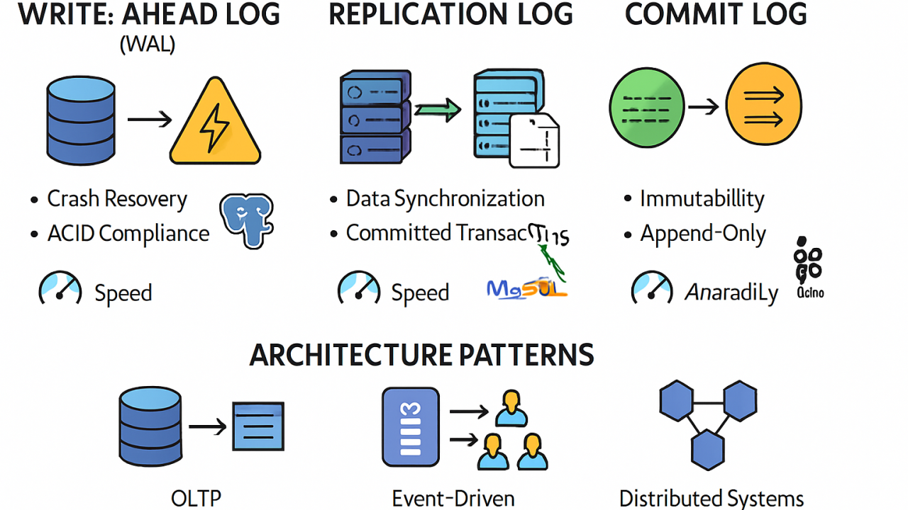

# The "No Log = No Action" (NLNA) Enforcement Architecture

## The Eradication of Optional Logging Failure

Traditional logging architectures suffer from a fundamental structural defect that renders them unsuitable for accountability-critical autonomous systems: they operate as asynchronous background processes decoupled from the execution paths they purport to document. This decoupling creates temporal gaps between an action's occurrence and its log commitment. In conventional designs, logging code executes through deferred interrupt handlers, depositing event records into volatile ring buffers. 

Under operational stress, power failure, or system crashes, these buffers are obliterated. The resulting loss scenarios create persistent states where an autonomous agent has altered physical or logical reality without leaving any forensic trace of its inputs, active reasoning weights, or uncertainty metrics. The system effectively commits a "ghost actuation." Post-hoc reconstruction techniques attempt to recover this accountability through state inference and simulation, but these methods prove fundamentally insufficient. Missing state vectors prevent deterministic replay, and undetectable tampering allows adversaries to manipulate both physical outcomes and their apparent histories.

This repository introduces the **"No Log = No Action" (NLNA)** enforcement specification. This framework transforms transparency from a passive diagnostic property into an active, non-bypassable system constraint. Execution is cryptographically coupled to memory. An action physically cannot occur unless a verifiable log exists first.

---

## The Cryptographic Actuator Interlock

The transformation of logging from a background process to a protocol-level gate requires fundamental architectural restructuring. The NLNA invariant is enforced through a Cryptographic Actuator Interlock, establishing a strict write-before-execute coupling at the lowest levels of the system architecture.

When the primary inference engine calculates a proposed course of action, the resulting output payload is isolated in a secure volatile buffer. The system must generate a comprehensive log capturing the inputs, the active reasoning weights, and the proposed decision vector. The cryptographic hash of this log serves as the absolute pre-commitment anchor. 

Crucially, this generated hash is mathematically transformed into the cryptographic authorization token required by the downstream actuator microcontroller. Without the successful generation and commitment of this specific hash, the physical actuator cannot mathematically authenticate or decrypt the incoming command payload. The execution controller must physically present the valid log hash to the interlock mechanism while the secure storage element provides a hardware-level write-acknowledgment signal. Inference results are physically trapped within the processor's architecture and cannot trigger physical state changes without the absolute completion of this cryptographic logging sequence.

---

## The Write-Before-Execute Model

The NLNA architecture adapts traditional database Write-Ahead Logging (WAL) concepts and implements them directly at the cyber-physical hardware boundary. A local accumulator buffer stores the serialized log in high-speed non-volatile memory before the actuator is electrically engaged. 

The execution gating primitives are integrated directly into the system bus architecture. The instruction pointer is physically blocked from advancing to the actuation subroutines until the voltage differential on the storage controller's write-confirm pin verifies that the memory is permanent. This creates an unbreakable cryptographic chain of custody between the machine's internal reasoning and its external influence.

---

## Hardware Root of Trust & Adversarial Resistance

Software-only enforcement of the NLNA invariant is inherently insecure. A compromised operating system kernel, a malicious insider, or a root user could trivially patch the evaluation logic to bypass the logging verification check. 

To guarantee absolute adherence, the enforcement mechanisms are immutably anchored in a Hardware Root of Trust. This architecture mandates the utilization of secure hardware enclaves—such as Trusted Execution Environments (TEEs), Hardware Security Modules (HSMs), and Trusted Platform Modules (TPMs)—to physically isolate the gating logic away from the primary operating system. Cryptographic signing processes and key storage occur entirely within these hardened boundaries. Because the main operating system cannot access the protected memory space of the secure enclave, it is structurally impossible for a compromised kernel to forge a signature, bypass the interlock, or suppress the logging requirement.

---

## Integration with Dual-Lane Architecture

To synthesize the absolute requirement for cryptographic logging with the extreme performance and latency demands of high-frequency autonomous operations, this specification implements a strictly segregated Dual-Lane Architecture.

* **The Fast Lane:** This hardware lane is entirely dedicated to primary inference and the immediate execution interlock. Operating with a strict sub-two-millisecond latency requirement, the system generates the local cryptographic hash and commits the log to the high-speed local non-volatile memory accumulator. This localized commitment fully satisfies the NLNA invariant, releasing the authorization token to the actuator instantly.
* **The Slow Lane:** Operating in parallel, this asynchronous governance mechanism extracts committed logs from the local hardware accumulator to handle computationally heavy tasks, including Merkle tree batching, cryptographic signing, and public blockchain anchoring. 

This deliberate separation ensures that local durability is established instantly in the Fast Lane to permit immediate execution, while public proof is established asynchronously in the Slow Lane.

---

## Cyber-Physical Safe Harbor States

Applying a strict, binary fail-closed halt to active cyber-physical systems (such as autonomous vehicles or high-speed robotics) can be physically catastrophic. If the cryptographic interlock denies execution due to a logging failure, the system must invoke hardcoded transition rules that transfer physical control to a Cyber-Physical Safe Harbor State.

Decision authority is instantaneously revoked, and control stability is handed over to a secondary, physically isolated microprocessor subsystem utilizing purely reactive, deterministic algorithms. The sole operational mandate of this stability subsystem is to guide the physical platform to a state of lowest kinetic energy using mathematically optimal deceleration curves, ensuring the system fails gracefully rather than catastrophically.

---

## Repository Artifacts and Documentation

The artifacts in this repository provide the definitive engineering rulesets for implementing the NLNA invariant across autonomous platforms.

### 1. Core Doctrine Enforcement Specification
The foundational system law defining NLNA as a non-negotiable architectural constraint, detailing the execution coupling, the Sacred Zero epistemic hold, and system failure behaviors.
* **Text:** [View Markdown](TML_Core_Doctrine_Enforcement_Specification.md)
* **Web:** [View HTML](https://fractonicmind.github.io/TernaryMoralLogic/No_Log-No_Action/TML_Core_Doctrine_Enforcement_Specification.html)
* **Audio:** [Listen to MP3 Overview](https://fractonicmind.github.io/TernaryMoralLogic/No_Log-No_Action/TML_Core_Doctrine_Enforcement_Specification.mp3)

### 2. Cryptographic Hardware Enforcement Specification
The deep implementation specification detailing the physical hardware boundaries, Merkle accumulation protocols, hardware roots of trust, and the cyber-physical state machines required for complete architectural compliance.
* **Text:** [View Markdown](/TML_Cryptographic_Hardware_Enforcement_Specification.md)
* **Web:** [View HTML](https://fractonicmind.github.io/TernaryMoralLogic/No_Log-No_Action/TML_Cryptographic_Hardware_Enforcement_Specification.html)

---
### License

This work is licensed under a Creative Commons Attribution 4.0 International License (CC BY 4.0).
