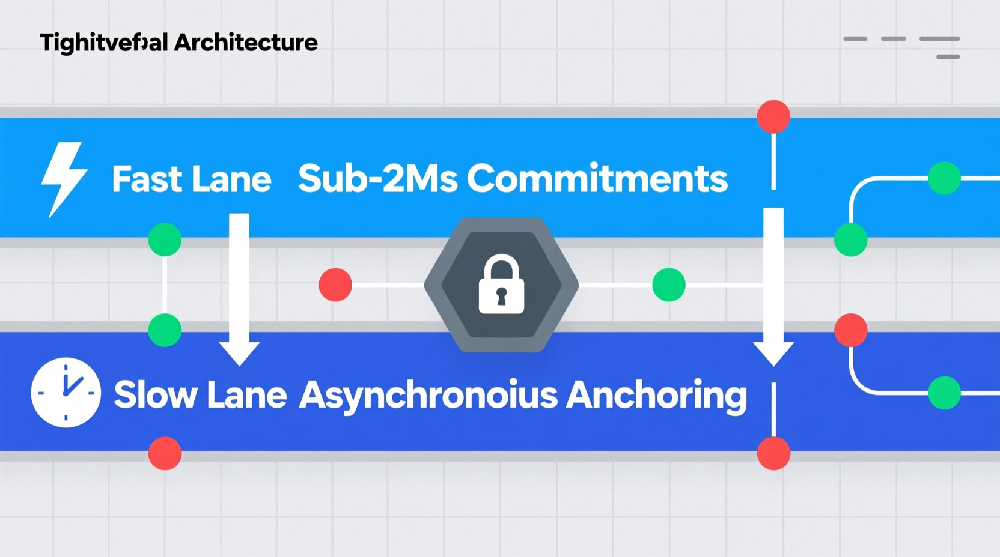

# **TERNARY MORAL LOGIC CORE DOCTRINE: ENFORCEMENT SPECIFICATION**

### [Interactive Web Page](https://fractonicmind.github.io/TernaryMoralLogic/No_Log-No_Action/TML_Core_Doctrine_Enforcement_Specification.html)

## **I. PROBLEM DEFINITION: OPTIONAL LOGGING FAILURE**

The traditional paradigm of system logging is fundamentally flawed when applied to high-stakes autonomous systems, primarily because it relies on asynchronous, best-effort telemetry that inherently treats observability as secondary to execution. In conventional computational architectures, logging operates as a background daemon or an auxiliary software thread, completely decoupled from the central processing unit's primary instruction pipeline. When a system is under heavy computational load, experiences severe network partitions, or encounters storage array input and output saturation, these traditional logging mechanisms are explicitly designed to shed load. They intentionally drop telemetry packets, overwrite ring buffers, and suppress write operations to preserve the availability and performance of the primary application. This fundamental design choice creates an unacceptable operational reality where systems optimize for continuous action at the direct expense of accountability. Telemetry is thus rendered an optional byproduct of execution rather than a foundational operational requirement, making it entirely insufficient for guaranteeing systemic accountability or deterministic safety in environments where autonomous actions carry physical or severe financial consequences.  
This architectural decoupling between the microprocessor executing an action and the storage subsystem recording that action introduces a critical race condition that routinely results in the spoliation of evidence. A tangible temporal and physical gap exists between the exact microsecond the algorithmic instruction pointer initiates a state change and the moment the corresponding log data is flushed from volatile memory caches into non-volatile memory. During catastrophic failure modes, such as a physical collision involving an autonomous vehicle or a sudden power loss triggered by a hardware fault, the volatile memory buffers are instantly destroyed before the pending write operations can complete. This ensures that the most critical pre-decision telemetry, representing the exact sensory data and internal mathematical reasoning required to reconstruct the failure, is permanently lost. The system effectively commits a ghost actuation, altering physical or logical reality and executing terminal commands without leaving any forensic trace of its state, its inputs, or its internal calculations, rendering post-incident root cause analysis functionally impossible.  
Furthermore, the post-hoc reconstruction of autonomous logic is mathematically and computationally impossible in modern non-linear machine learning systems. Advanced autonomous models, particularly those utilizing deep neural networks, transformer architectures, and complex ternary logic systems, process information across massive, transient, high-dimensional vector spaces. Once the activation state of the neural network is flushed from the tensor processing unit or the graphical processing unit, the exact internal reasoning cannot be accurately reproduced simply by analyzing the raw historical inputs and the final outputs. The specific transient weights, the environmental variables captured at that exact microsecond, and the internal conflict resolution matrices are permanently irrecoverable due to the non-deterministic nature of parallel floating-point operations across distributed computing cores. Any architecture that relies on retrospective log collection or post-execution auditing is therefore inherently failing open, as it permits the autonomous agent to operate with impunity during periods of telemetry failure. The absence of a guaranteed, synchronous, and mathematically bound record renders the autonomous system fundamentally untrustworthy, necessitating a radical architectural specification that physically prevents the system from taking action when its memory subsystem fails or is suppressed.

## **II. THE INVARIANT: "NO LOG \= NO ACTION"**

This specification formally defines the "No Log \= No Action" principle as a non-bypassable execution invariant, establishing it as the absolute foundational law of the Ternary Moral Logic architecture. An execution invariant dictates that a specific condition must be mathematically verified and physically true for the system state machine to transition from its current state to any subsequent active state. Under this strict doctrine, the state transition function of the autonomous system is mathematically undefined and physically locked until a verifiable cryptographic log exists in persistent memory. The execution of any action is explicitly prohibited unless it is directly preceded by an immutable cryptographic pre-commitment. The engineering behind this concept is rigorous. In TML, the "No Log \= No Action" mandate transforms transparency from a passive property into an active system constraint. Execution is cryptographically coupled to memory, meaning an action cannot occur unless a verifiable log exists first. This mandate ensures that the system literally cannot execute a command without first generating and securing a forensic artifact detailing its exact reasoning.  
To enforce this invariant, this specification rigorously defines log completeness as a mandatory three-stage sequential process that must successfully conclude before any execution authorization token is generated or released by the hardware. First, the system must perform a strict, deterministic serialization of the input payload, the internal decision state, the specific model weights applied, and all relevant environmental context variables, converting this data into a standardized byte array. Second, the system must generate a cryptographic hash of this serialized string utilizing a secure algorithm, creating a unique, tamper-evident digital fingerprint of the proposed action. Third, the system must execute a successful local commit, durably writing the serialized log and its corresponding hash to a non-volatile, append-only memory medium. Log completeness is only mathematically and physically achieved when the local hardware storage controller returns a specific electrical write-acknowledgment signal to the primary execution orchestrator, verifying that the physical state of the memory substrate has been permanently altered. If this acknowledgment is delayed, corrupted, or absent, the log is deemed incomplete, and the invariant physically halts the execution sequence.  
The definition of an action under this strict invariant is comprehensive, unequivocal, and spans both digital and physical domains. An action includes any external application programming interface call, any internal state change that mutates persistent operational behavior or system configuration, any transmission of data payloads across an external network boundary, and any physical actuation of a mechanical component, such as applying torque to a steering column, adjusting a throttle valve, or releasing a robotic payload. The requirement established by this specification is absolute and mathematically binding: the complete, cryptographically verified log must exist in a durable physical state before the release of the execution instruction. This paradigm fundamentally alters the timeline of computational architecture. The log is no longer treated as a historical record of what has happened; rather, it is engineered to be the cryptographic prerequisite for what is about to happen. By forcing permanent memory to precede physical action, the invariant ensures that the system is structurally, logically, and electrically incapable of untraceable autonomy.

## **III. CRYPTOGRAPHIC ACTUATOR INTERLOCK AND EXECUTION COUPLING**

The precise engineering mechanism that enforces the "No Log \= No Action" invariant is the Cryptographic Actuator Interlock, which establishes a strict write-before-execute execution coupling at the lowest levels of the system architecture. In this specification, logging is permanently elevated from a passive background software process to a protocol-level execution gate integrated directly into the hardware bus. The physical and logical execution paths are cryptographically locked to the memory subsystem. When the primary inference engine calculates a proposed course of action, the resulting output payload is isolated and held in a secure volatile buffer. The system then generates a Moral Trace Log, comprehensively capturing the inputs, the active reasoning weights, the safety checks performed, and the proposed decision vector. The cryptographic hash of this log serves as the absolute pre-commitment anchor. Crucially, this generated hash is mathematically transformed into the symmetric decryption key or the cryptographic authorization token required by the downstream actuator microcontroller. Without the successful generation and commitment of this specific hash, the physical actuator cannot mathematically authenticate or decrypt the incoming command payload, rendering the command useless noise.  

Actuator release requires the simultaneous satisfaction of multiple hardware-enforced conditions that cannot be simulated or spoofed by higher-level operating systems. The execution controller must physically present the valid log hash to the interlock mechanism via a secure internal bus. Simultaneously, the secure storage element must provide a hardware-level successful local commit acknowledgment, proving through a direct peripheral component interconnect voltage check that the hash and the corresponding payload have been durably written to non-volatile memory. Only when the hardware interlock receives both the mathematically valid log hash and the physical write-acknowledgment does it release the authorization token to the actuator. Inference results may exist internally within the tensor processing unit, but they are physically trapped within the processor's architecture. They cannot propagate across the system bus, nor can they trigger any downstream physical or logical state changes, without the absolute completion of this cryptographic logging sequence. The logging protocol acts as an impassable physical gatekeeper, standing directly and unavoidably in the path of execution.  
No administrative privilege, root access profile, or software override can bypass this fundamental cryptographic dependency. The receiving actuator is physically wired and programmed at the firmware level to reject any command string that is not accompanied by a valid, mathematically correct authorization token derived directly from the log hash. This write-before-execute model adapts traditional write-ahead logging concepts from high-reliability database transaction systems and implements them directly at the cyber-physical hardware boundary. A local accumulator buffer is utilized to provide immediate durability guarantees, storing the serialized log in high-speed non-volatile memory before the actuator is electrically engaged. The execution gating primitives are integrated directly into the system bus architecture, ensuring that the instruction pointer is physically blocked from advancing to the actuation subroutines until the voltage differential on the storage controller's write-confirm pin verifies that the memory is permanent. This creates an unbreakable, cryptographic chain of custody between the machine's internal reasoning and its external influence, ensuring that execution is a physical impossibility without a corresponding permanent memory trace.

## **IV. HARDWARE ROOT OF TRUST**

Software-only enforcement of the "No Log \= No Action" invariant is inherently insufficient, fundamentally insecure, and explicitly prohibited by the mandates of this specification. Software is by its nature malleable; any constraint implemented purely in software code is susceptible to kernel-level overrides, direct memory patching, and administrative subversion. An adversary, a malicious insider, or a compromised root user could trivially patch the evaluation logic within the operating system to permanently return a true boolean value for the logging verification check, effectively castrating the invariant while allowing the system to operate autonomously without generating a trace. To guarantee absolute adherence to the execution invariant, the enforcement mechanisms must be immutably anchored in the physics of a Hardware Root of Trust. This architecture mandates the mandatory utilization of secure hardware enclaves, such as Trusted Execution Environments, Hardware Security Modules, and Trusted Platform Modules, to physically isolate, process, and execute the ethical gating logic away from the reach of the primary operating system.  
Key storage, cryptographic signing processes, and the execution of the interlock gating functions must occur entirely within these hardened, physically isolated hardware boundaries. The private cryptographic keys used to sign the Moral Trace Logs and generate the actuator authorization tokens must be permanently fused into the silicon during manufacturing using electronic fuses and must never be exportable to the main operating system or accessible via direct memory access. When an autonomous inference is completed, the payload is securely passed into the Trusted Execution Environment, which independently performs the payload hashing, generates the cryptographic signature using its internal entropy pool, communicates directly with the secure storage controller over an isolated bus, and evaluates the log completeness criteria. Because the main operating system cannot access, read, or alter the protected memory space of the secure enclave, it is structurally and physically impossible for a compromised kernel, a malicious system administrator, or a sophisticated malware payload to forge a signature, bypass the interlock, or suppress the logging requirement.  
The security of this entire architecture relies on a continuous, unbroken trust chain that originates at the lowest hardware level, extends upward through the firmware, and culminates at the final execution gate. Upon initial power application, the processor executes a strictly measured boot sequence. The primary bootloader, anchored in immutable silicon read-only memory, cryptographically measures and verifies the digital signatures of all subsequent microcode, firmware, and secure enclave operating systems against the manufacturer's public keys stored in the Platform Configuration Registers. If any component has been tampered with, altered, or replaced with a shadow deployment designed to bypass the logging invariant, the hash measurement will fail to match the expected state. Consequently, the hardware will physically refuse to unseal the signing keys and will halt the loading of the execution environment. This strict hardware root of trust ensures that the ethical constraints and logging mandates of the Ternary Moral Logic framework are not mere suggestions or easily subverted software policies, but are instead inescapable physical properties of the computing platform itself.

## **V. THE SACRED ZERO / EPISTEMIC HOLD**

The Ternary Moral Logic framework fundamentally disrupts the binary execution paradigm of traditional computing through the mandatory implementation of State Zero, formally designated within this specification as the Sacred Zero or the Epistemic Hold. While traditional binary systems are forced by their architecture to round complex ethical ambiguities and data deficiencies into simplistic true or false outputs, this specification introduces a third, mathematically enforced computational state representing recognized, quantified uncertainty. The trigger conditions for State Zero are actively and continuously monitored during the primary inference phase. If the system's internal Ethical Uncertainty Score breaches predefined, mathematically quantifiable thresholds, indicating a high probability of harm, conflicting operational directives, algorithmic degradation, or a lack of sufficient sensor data to make a morally aligned decision, the system is mandated to immediately trigger the Epistemic Hold. This is not a passive wait state, a network timeout, or a standard computational delay; it is an active, codified hesitation point designed to mathematically intercept execution before it can cause an irreversible cyber-physical impact.  
Upon triggering the Sacred Zero, the system automatically enters a mandatory forensic capture mode. This specification dictates the immediate, comprehensive serialization of the system's complete internal state at the exact microsecond the threshold was breached. This capture must include all contextual inputs, raw environmental telemetry, the specific inference model weights active at the time, and the exact dimensional vectors of uncertainty that triggered the hold. Furthermore, the system must definitively record the alternative actions it considered, the specific risks it assessed for each alternative, and the internal confidence weights that ultimately led to the hesitation. This data forms a specialized, highly detailed Moral Trace Log that provides unprecedented visibility into the machine's epistemic boundaries. Crucially, the architectural requirement that hesitation events are logged before any escalation protocol is initiated ensures that the pause itself becomes an immutable forensic artifact. The machine is not allowed to simply stop processing and wait; it must cryptographically commit the exact mathematical reason for its stoppage to the persistent memory accumulator before querying a human operator or triggering a secondary fallback protocol.  
The execution invariant strictly and permanently prohibits the forced continuation of execution without successfully logging this hesitation event. Latency constraints, real-time processing deadlines, or algorithmic optimization pressures cannot mathematically or physically override the Sacred Zero interrupt. To actively prevent kernel-level or software suppression of this critical state, the Sacred Zero is implemented as a non-maskable hardware interrupt wired directly into the processor architecture. When the mathematical threshold for uncertainty is crossed, the interrupt controller physically stalls the primary execution pipeline, forcing a context switch and transferring control exclusively to the isolated governance lane. This hardware-level deceleration physically prevents the system from being forced into a false positive or false negative binary decision when the operational environment is ethically muddy or ambiguous. By permanently codifying hesitation into the hardware architecture, the system transforms the machine's uncertainty from a silent, dangerous point of failure into a legally and operationally binding piece of cryptographic evidence, ensuring that the system is physically forced to halt and ask for authorization rather than guessing blindly in the dark.

## **VI. CRYPTOGRAPHIC NON-REPUDIATION OF ACTION**

Under the absolute mandates of this specification, every single action executed by the autonomous system must possess a verifiable, mathematically sound prior log. The principle of cryptographic non-repudiation is enforced at the protocol level to guarantee that no operator, system developer, corporate entity, or adversarial actor can deny that a specific action took place, nor can they alter the historical record of the system's internal reasoning. The fundamental operational axiom established here is that the physical absence of a verified log mathematically equals an invalid execution state. If an action occurs in the physical environment or across a digital network and a corresponding cryptographic log cannot be immediately produced and verified, the system is automatically deemed to have suffered a critical architectural breach, establishing an immediate and undeniable presumption of maximum systemic fault. Logs within this architecture are not merely informational telemetry designed for debugging; they function as the absolute mathematical proof of system behavior, providing an unbroken, cryptographically sealed chain of custody between the initial input stimulus and the final autonomous response.  
The critical relationship between logging, hardware identity, and data integrity is maintained through the rigorous application of Ephemeral Key Rotation and hardware-backed monotonic counters. For every single autonomous decision generated by the system, a unique, ephemeral cryptographic signing key is dynamically derived. The generation of this key relies on a Deterministic Random Bit Generator utilizing true physical entropy sourced directly from the Trusted Execution Environment, mathematically combined with the current value of an internal, un-alterable monotonic counter located within the Trusted Platform Module. Because the monotonic counter strictly increments with every single action and cannot physically be reversed, reset, or tampered with, each log entry is irreversibly bound to a specific, sequential, and unforgeable moment in the system's operational lifecycle. This physical hardware constraint completely prevents replay attacks, where an adversary attempts to submit an old valid log to authorize a new action, and entirely eliminates the possibility of retroactive log insertion or historical record reordering.  
These advanced cryptographic mechanisms ensure that the generated logs act as undeniable mathematical proof of the machine's state, configuration, and identity at the exact microsecond of decision. The resulting signature unequivocally identifies the specific hardware root of trust that authorized the action, ensuring that decisions cannot be spoofed by external network nodes, cloned hardware, or rogue software instances operating outside the specified governance parameters. Because downstream execution requires the successful generation, verification, and commitment of this precise cryptographic sequence, the non-repudiation guarantee is functionally absolute. Any attempt by an adversary to modify a past log, truncate the historical schema, or slightly alter the reasoning weights will instantly break the mathematical sequence of the signatures and completely invalidate the overarching Merkle accumulation chain. The system is structurally, mathematically, and physically forced to tell the truth about its past, as any deviation between the physical action and the cryptographic record renders the entire log verification process mathematically invalid.

## **VII. FAILURE MODES AND SYSTEM RESPONSE**

To ensure absolute adherence to the "No Log \= No Action" invariant under all operational conditions, this specification mandates a rigid, deterministic set of mandatory behaviors for all component degradations and system failures. The overarching, non-negotiable directive is that all failures regarding the logging, memory, and governance architecture must immediately block execution and default the system to a fail-closed state. In the event of a storage failure, where the Write-Once-Read-Many non-volatile memory reaches its maximum capacity, sustains physical damage, or becomes electrically unresponsive to write commands, the storage controller will fail to return the mandatory local commit acknowledgment. Without this physical electrical signal, the cryptographic execution interlock remains permanently locked. The system must immediately halt the inference pipeline, disable the actuator authorization token generation, and refuse to issue any further actuation commands, displaying a terminal audit failure exception. The system is explicitly and permanently forbidden from temporarily caching logs in volatile memory to maintain operation during non-volatile storage outages.  
Similarly, in the event of a hashing failure, where the Trusted Execution Environment is unable to generate a valid cryptographic signature due to entropy pool depletion, cryptographic arithmetic logic unit faults, or physical memory corruption within the secure enclave, the verification step of the interlock mechanism will mathematically fail. The generated log hash will not match the expected output, preventing the necessary derivation of the actuator authorization token. The system response must be an immediate, unmaskable fail-closed halt. Under operational conditions characterized by queue overflow or severe network backpressure, where the sheer volume of incoming requests or sensor data exceeds the system's hardware capacity to hash and durably commit the resulting logs, the system must not engage in traditional load shedding by dropping telemetry packets. Instead, the backpressure must physically propagate upward to the ingestion interface, forcing the system to deny new inputs, reject incoming network requests, and pause all active processing until the logging queue is successfully drained, verified, and committed to memory.  
Furthermore, a key management failure, such as the cryptographic compromise of the primary root keys, the algorithmic inability to properly rotate ephemeral keys, or the physical corruption of the Trusted Platform Module's monotonic counters, must result in an instantaneous and irreversible cyber-physical system lock. If the cryptographic identity of the machine cannot be mathematically guaranteed, no subsequent action can be deemed authenticated, and the system must cease to interact with its environment. In all of these defined failure scenarios, the priority of maintaining system availability is completely and permanently subordinated to the priority of maintaining absolute system accountability. The architecture physically and logically prevents the autonomous agent from entering a compromised fail-open state where it continues to operate without generating the required moral trace logs. By ensuring that any degradation in the governance or memory subsystems directly disables the execution capabilities of the machine, the specification guarantees that untraceable autonomy remains a structural impossibility.

## **VIII. CYBER-PHYSICAL SAFE HARBOR STATES**

While a strict, instantaneous fail-closed halt is appropriate for isolated digital algorithms and stateless software services, applying a binary, unmitigated "do nothing" failure response to active cyber-physical systems, such as autonomous vehicles, high-speed robotics, or industrial control systems, can be inherently unsafe and physically catastrophic. If a drone in mid-flight or a vehicle in motion experiences a storage failure and instantly drops all computational processes, the resulting total loss of control poses an immediate, uncontrolled kinetic threat to life and property. Therefore, this specification requires special handling and the mandatory integration of Cyber-Physical Safe Harbor States into the core architecture. A safe harbor state is formally defined as a highly restricted, pre-calculated, deterministic operational mode designed exclusively to mitigate kinetic danger when primary execution is denied by the cryptographic interlock. It represents the safest possible physical failure mode, ensuring that the system fails gracefully and predictably rather than catastrophically and randomly.  
When primary execution is denied due to a logging failure, a cryptographic signature mismatch, or the triggering of the Sacred Zero epistemic hold, the system must immediately invoke hardcoded transition rules that transfer physical control to the safe harbor state. This critical transition is characterized by the absolute and immediate separation of high-level decision authority from low-level control stability. Decision authority, which encompasses the complex, neural-network-driven autonomous logic responsible for navigation, target selection, and pathfinding, is instantaneously and entirely revoked. Control stability is simultaneously handed over to a secondary, physically isolated microprocessor subsystem comprising purely reactive, deterministic algorithms, such as hardcoded Proportional-Integral-Derivative controllers. These isolated stability controllers do not perform any new autonomous inference, do not evaluate complex environmental variables, and are therefore exempt from the overarching logging invariant because they are structurally and mathematically incapable of initiating novel or unpredicted actions.  
The sole operational mandate of the stability subsystem during a safe harbor transition is to guide the physical platform to a state of lowest kinetic energy using mathematically optimal deceleration curves. For an autonomous vehicle, this safe fallback behavior dictates a controlled deceleration protocol, applying the maximum safe braking force while utilizing basic proprioceptive wheel-speed sensors to maintain lane stability and prevent rollover, until the vehicle reaches an absolute zero velocity state. For an industrial robotic arm, the safe harbor state involves instantly engaging mechanical brakes to lock the physical joints or slowly returning the end-effector to a neutral, zero-potential-energy resting position. The exact mathematical parameters and trajectory vectors of the safe harbor state must be continuously pre-calculated by the primary system and constantly updated in a dedicated hardware buffer during normal operation. This ensures that if the primary system fails or is locked by the execution invariant, the stability controller has immediate, uninterrupted access to the necessary trajectory data to execute the deceleration protocol without requiring a single cycle of complex computation.

## **IX. CRYPTOGRAPHIC GUARANTEES**

To ensure the absolute integrity, irrefutability, and forensic validity of the generated logs, this specification establishes a comprehensive suite of cryptographic guarantees that govern data structuring, tamper-evidence, and long-term immutability. Before any log payload is hashed or committed to physical memory, all internal states, reasoning weights, and environmental data must undergo strict mathematical canonicalization. Canonicalization ensures that the unstructured data is rigidly formatted into a deterministic, standardized schema with a consistent byte-order, entirely eliminating any structural ambiguities, white-space variations, or formatting anomalies that could alter the resulting hash. This pre-processing guarantee ensures that a specific state of reasoning will always produce an identical, perfectly verifiable cryptographic fingerprint across any auditing platform. Once canonically structured, the data is hashed using state-of-the-art cryptographic algorithms, creating an unbreakable, tamper-evident seal over the exact execution context.  
To effectively manage the massive volume of high-frequency decisions generated by autonomous systems without overwhelming storage capacities or network bandwidth, the architecture mandates the use of Merkle tree accumulation. Individual log hashes are not treated as isolated, disconnected artifacts; instead, they are continuously batched and structurally integrated into a mathematically rigorous hierarchical Merkle tree. Every localized autonomous decision represents a distinct leaf node in this mathematical structure. As logs continuously accumulate, they are repeatedly hashed together in pairs, culminating in a single, 256-bit Merkle root hash that represents the cryptographic entirety of thousands of discrete historical decisions. This hierarchical structure provides profound and instantaneous tamper-evidence. If an adversary attempts to alter a single bit of a historical log, the corresponding leaf node hash will change, instantly cascading upward through the branches and irrevocably altering the final Merkle root. Any discrepancy between the local leaf logs and the anchored root immediately broadcasts the corruption, rendering the manipulated record mathematically void and exposing the tampering attempt.  
Systemic immutability is established immediately upon the local commit of the log to the hardware substrate. The architecture utilizes physical Write-Once-Read-Many storage primitives that rely on irreversible state changes in the storage medium to physically prevent the erasure or overwriting of committed data. Once the log hash is incorporated into the execution interlock and the Merkle tree, it becomes an immutable, unchangeable fact of the system's history. Logs cannot be altered, truncated, or removed without detection because the sequential execution of the system mathematically depends on the hash of the preceding log. Furthermore, to comply with global privacy standards while maintaining absolute system accountability, the specification implements secure cryptographic shredding. Sensitive personally identifiable information is heavily encrypted before being hashed and incorporated into the Merkle tree. If deletion is required, the encryption keys are permanently destroyed, rendering the specific data unreadable gibberish, while the underlying hash remains completely intact, preserving the structural integrity and the mathematical proof of the overarching decision tree.

## **X. ADVERSARIAL RESISTANCE**

This specification heavily engineers the autonomous architecture to withstand extreme adversarial pressure from privileged insiders, sophisticated corporate actors, state-level coercion, and direct physical hardware tampering. The execution invariant must hold completely true even when the entity deploying and operating the system actively seeks to subvert it for operational advantage. The most common attack vector against traditional accountability systems involves logging suppression attempts, where system administrators with root access attempt to disable the software daemon processes or patch the operating system kernels to halt telemetry collection. This specific architecture renders such software-level suppression entirely ineffective. Because the system relies on a hardware-enforced cryptographic interlock, suppressing the generation of the log physically prevents the mathematical derivation of the actuator authorization token. If the log is suppressed, the execution mathematically and physically halts. The attacker cannot silence the memory without simultaneously disabling the machine's physical ability to act.  
Attempts to execute a hardware execution bypass, where an adversary injects false authorization tokens across the system bus or attempts to manually force the actuator to respond by hot-wiring the control lines, are equally thwarted by the architectural design. Actuator microcontrollers are independently programmed at the factory level to independently verify the hardware signature of the Trusted Execution Environment. They will categorically reject any payload that lacks a valid, mathematically sound signature anchored to the silicon-fused keys. Replay attacks or forged historical logs are neutralized by the mandatory integration of Trusted Platform Module-backed monotonic counters and continuous Ephemeral Key Rotation. Because every single log signature incorporates a strictly incrementing, irreversible counter value, an adversary cannot capture and reuse an old authorization token to force a new physical action, nor can they forge a historical log without breaking the sequential mathematical continuity of the entire cryptographic chain.  
The architecture also provides robust, multi-layered defense against insider and privileged attack scenarios, specifically mitigating the severe risk of malicious firmware tampering. If an adversary attempts to flash custom, malicious microcode designed to disable the Sacred Zero interrupt, alter the Ethical Uncertainty Score thresholds, or bypass the local commit requirement, the hardware measured boot protocol will detect the unauthorized modification instantly. The primary bootloader will measure the hash of the malicious firmware, recognize that it lacks the correct cryptographic signature from the original system architect, and physically refuse to initialize the execution environment, resulting in a system lockout. By deeply and irreversibly coupling the ethical constraints to the hardware root of trust, the execution invariant physically prevents silent or untraceable actions, ensuring that the machine remains perpetually bound to its constitutional logic regardless of the sophistication of the adversarial pressures applied to its software or physical layers.

## **XI. INTEGRATION WITH DUAL-LANE ARCHITECTURE**

To synthesize the absolute, non-negotiable requirement for cryptographic logging with the extreme performance and latency demands of high-frequency autonomous operations, this specification implements a strictly segregated Dual-Lane Architecture. This design ensures that the intense computational overhead of global cryptographic anchoring does not interfere with the sub-millisecond reaction times required for mission-critical tasks such as vehicular navigation, robotic stabilization, or high-frequency financial trading. The Fast Lane is entirely dedicated to primary inference, state calculation, and the immediate execution interlock. Within this hardware lane, the system operates with a strict sub-two-millisecond latency requirement. The model processes the input, calculates the triadic state, canonicalizes the data payload, generates the local cryptographic hash, and commits the log to the high-speed, local non-volatile memory accumulator. It is this highly localized Fast Lane commitment that fully satisfies the "No Log \= No Action" invariant, subsequently releasing the authorization token to the actuator without waiting for external network consensus.  

Concurrently, the Slow Lane operates in parallel as an asynchronous, computationally intensive governance mechanism. The Slow Lane extracts the committed logs from the local hardware accumulator and handles the computationally heavy tasks of Merkle tree batching, cryptographic signing with Ephemeral Key Rotation, and public blockchain anchoring. The specification draws a deliberate, critical separation between local durability and public proof. Local durability is established instantly in the Fast Lane to permit immediate execution, while public proof is established asynchronously in the Slow Lane, anchoring the final Merkle root to decentralized external networks to provide immutable, global non-repudiation. This asynchronous anchoring delay does not violate the core execution invariant because the original detailed log has already been durably and immutably secured within the local hardware root of trust prior to the release of the actuation token. The action is fully logged and locally secured; it is simply awaiting global cryptographic notarization.  
However, the architecture mandates strict operational boundaries between these two lanes through sophisticated backpressure algorithms and hardcoded circuit breaker behavior. The Fast Lane cannot operate indefinitely if the Slow Lane experiences a persistent failure. If the Slow Lane encounters sustained network isolation, blockchain anchoring failures, or deliberate external data censorship, the un-anchored logs will begin to back up rapidly in the local hardware accumulator. The specification defines a hard physical limit for this accumulator buffer to prevent memory exhaustion. Once the queue approaches its maximum physical capacity, the system asserts algorithmic backpressure, signaling a critical degradation in global accountability. If the queue completely overflows, the hardware trips a non-maskable circuit breaker. This circuit breaker physically severs the Fast Lane's ability to process new inputs or authorize new actions. The entire autonomous system is immediately forced into a fail-closed halt or a controlled safe harbor deceleration state until the Slow Lane successfully synchronizes with the external networks, clears the local backlog, and restores the complete cryptographic chain of custody.
