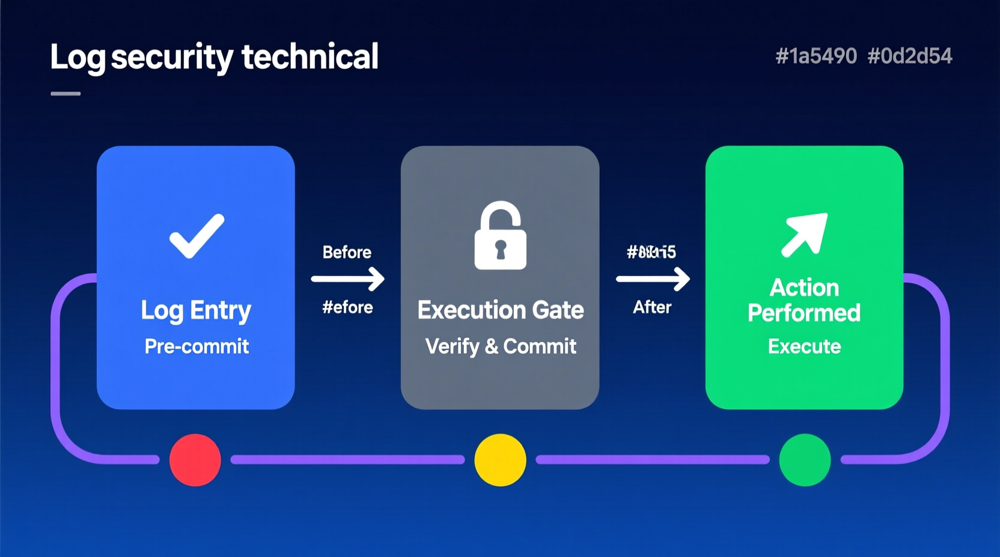

# **No Log \= No Action:**

# **Ternary Moral Logic Enforcement Specification**

## I. PROBLEM DEFINITION: OPTIONAL LOGGING FAILURE

Traditional logging architectures operate as asynchronous background processes decoupled from execution paths, creating fundamental structural defects that render them unsuitable for accountability-critical autonomous systems. This decoupling generates temporal gaps between action occurrence and log commitment, typically ranging from milliseconds to seconds under normal operation and becoming unbounded under stress, which admits catastrophic loss scenarios where system crashes, power failures, or resource exhaustion obliterate documentary traces of completed actions. Conventional designs execute logging code through deferred interrupt handlers or dedicated kernel threads that deposit event records into ring buffers flushing to persistent storage under scheduling policies optimized for throughput rather than durability, resulting in buffer overflow behaviors that trigger silent event dropping rather than blocking execution to preserve accountability. Race conditions between log generation and system failure create persistent states where actions have occurred without possibility of reconstruction, as the window between instruction retirement initiating external effect and write acknowledgment from durable storage remains unprotected. Telemetry-based accountability mechanisms compound these deficiencies through network-dependent delivery semantics that introduce additional uncontrollable failure modes, as network partitions sever paths between event generation and log aggregation without guaranteed notification to the originating system, causing records to accumulate in volatile or locally-durable buffers that may never achieve global persistence. Clock synchronization protocols cannot establish strict causal ordering across distributed components experiencing relative drift and jitter, destroying deterministic replay properties required for forensic reconstruction. Emergency shutdown sequences frequently bypass standard logging infrastructure to achieve deterministic latency targets, creating high-stakes scenarios where accountability is least available, while direct hardware manipulation through memory-mapped I/O, DMA engines, or debug interfaces permits actuation commands to reach physical interfaces without traversing software stacks including their logging instrumentation. Post-hoc reconstruction techniques attempting to recover accountability through state inference, physical simulation, and external observation prove fundamentally insufficient for high-consequence autonomous operation, as missing state vectors including internal neural network activations and entropy source outputs prevent deterministic replay even when external behavior is approximately known, and undetectable tampering in reconstructed sequences allows adversaries with system access to manipulate both physical outcomes and their apparent histories.

## II. THE INVARIANT: "NO LOG = NO ACTION"

The transformation from conventional optional logging to mandatory invariant enforcement requires formal specification as a system property holding across all execution paths without exception, expressed in predicate logic as stating that for all execution paths and actions, execution implies existence of a logged entry that precedes the action and satisfies cryptographic integrity verification, thereby eliminating action execution without prior log existence through logical necessity rather than engineering convention. Temporal logic specifications strengthen this with before-operator semantics requiring that in all states, if an action will occur in the next moment, then eventually some log entry precedes it with strict temporal ordering, with inductive proof obligations requiring demonstration that all state transitions preserve this property. Log completeness under this specification demands serialization establishing total ordering through hybrid logical-physical timestamps combining Lamport clocks for distributed causality tracking with hardware-generated nanosecond-precision counters for local ordering, ensuring unambiguous ordering with deterministic tie-breaking for apparent concurrency. Hashing binds content to sequence position through cryptographic digest functions with preimage resistance, second-preimage resistance, and collision resistance, with each entry incorporating its predecessor's hash to form an immutable chain where modification propagates forward as detectable invalidity. Local commit requires durable write acknowledgment from tamper-resistant non-volatile memory with write latency below the action release threshold, verified through read-back confirmation and integrity check before gate release, transforming database write-ahead logging principles from performance optimizations into enforcement mechanisms. The action taxonomy encompasses API calls representing external interface invocations with network-visible side effects intercepted at system call boundaries, state changes comprising persistent modifications to system memory or storage affecting future behavior intercepted at memory management units, and physical actuation denoting energy transfer across the cyber-physical boundary including motor control signals and valve positions intercepted at actuator driver levels, with the invariant applying uniformly across all categories without exemption for emergency procedures or diagnostic modes. The execution release precondition establishes log existence as necessary condition for action enablement, implemented through verification gate location in the processor pipeline between instruction decode and execution retirement, ensuring pipeline speculation may proceed but architectural state changes with external effect remain contingent on logging verification, with irrevocable commitment occurring when hardware logging subsystems generate attestation quotes binding log entries to platform identity.

## III. CRYPTOGRAPHIC ACTUATOR INTERLOCK AND EXECUTION COUPLING

The transformation of logging from background process to protocol-level gate requires fundamental architectural restructuring that eliminates any execution path bypassing logging verification through synchronous insertion into the critical execution path where every action proposal stalls at a hardware-enforced barrier until logging completion is cryptographically verified, prohibiting deferred write patterns, asynchronous notification mechanisms, or optimistic execution with rollback capability. Blocking semantics require caller stall until commit acknowledgment arrives from hardware-backed logging subsystems, with timeout handling defaulting to execution denial rather than optimistic continuation. Cryptographic execution path locking binds proposed actions to prior system state through hash chain construction making action authorization contingent on valid log chain maintenance, with each proposed action incorporating the hash of the most recent committed log entry to create cryptographic happens-before relationships. The Merkle accumulator root serves as execution capability token maintained in hardware-protected registers accessible to execution gates but modifiable only by logging subsystems, with any attempt to execute without valid capability token triggering immediate fault and safe harbor transition. Actuator release imposes three independent cryptographic requirements: valid log hash ensuring preimage resistance preventing forgery through recomputation matching declared hash with collision resistance ensuring distinct action histories cannot produce identical verification outcomes, local commit acknowledgment requiring hardware-generated attestation quotes binding stored log entries to platform identity with quote generation in isolated execution environments, and inference containment permitting internal computation to proceed without logging overhead while preventing propagation of results to external effect until logging completes. Override impossibility guarantees eliminate administrative escape hatches through architectural prohibition of software-accessible bypass registers, with all gate control signals routing exclusively through hardware logic modifiable only by logging subsystems and hardware-enforced privilege level isolation ensuring even hypervisor code and system management mode firmware must satisfy identical logging requirements. The write-before-execute model ensures log entry durability before instruction retirement, guaranteeing no instruction with external effect completes before corresponding log acknowledgment from hardware-backed storage, with transactional semantics enforcing atomic commit or full abort preventing partial logging failures from enabling partial execution. Local durability infrastructure provides hardware foundation for commit acknowledgment independent of external system state through battery-backed accumulators maintaining hash chain continuity across power events and circular buffers with cryptographic watermarking enabling overflow detection without false positives. Execution gating primitives implement hardware-software interfaces with minimal latency overhead through capability registers holding current valid Merkle root hashes updated atomically by logging subsystems and read by execution gate comparators triggering fault on hash mismatch with latency bounded by processor clock cycles. Transaction system integration extends invariant enforcement to distributed operations through two-phase commit coordination treating logging as prepare phase with all participants requiring local log durability before voting commit, and consensus participation contingent on local log durability ensuring nodes cannot vote on distributed decisions without accountable local state.

## IV. HARDWARE ROOT OF TRUST

Secure enclave deployment establishes isolated execution environments for logging kernel operations through Trusted Execution Environment technology ensuring logging code executes in hardware-protected domains inaccessible to normal operating systems or hypervisors, with memory encryption preventing physical memory probing and remote attestation of enclave measurements enabling external verification that correct implementations execute. Trusted Platform Module functions extend hardware root of trust to platform-wide integrity measurement through Platform Configuration Registers storing extended log hash chains via chained extend operations with automatic inclusion in attestation quotes binding log state to TPM identity, creating cryptographically verifiable proof of system configuration and logging completeness. Hardware Security Module integration provides highest assurance levels for critical logging operations through HSM-hosted signing keys ensuring key material never exists outside hardware-protected boundaries, with rate-limited signing preventing flooding attacks and key ceremony procedures eliminating software exposure during generation through threshold schemes distributing shares across multiple HSMs.   

Software-only enforcement proves demonstrably insufficient for invariant guarantees through fundamental attack vectors including kernel compromise enabling direct memory manipulation to forge log entries or suppress logging while maintaining apparent system operation, hypervisor escape permitting logging bypass by executing at privilege levels above virtualized logging infrastructure, and supply chain attacks substituting logging implementations during build or deployment. Hardware boundary enforcement extends protection to physical attack vectors through physical unclonable functions binding keys to specific silicon instances preventing extraction and replay on attacker-controlled hardware, side-channel resistant implementation preventing information leakage through timing or power consumption, and tamper detection triggering key destruction and system halt upon physical intrusion or environmental anomaly. Privilege level bypass prevention closes architectural escape routes from most privileged software execution modes through ring negative one hypervisor exclusion from logging gate control ensuring full machine access cannot modify logging behavior, system management mode intercept extending invariant enforcement to firmware-level operations, and debug port disablement or authentication requirements preventing JTAG interfaces from becoming attack vectors. Trust chain construction provides verifiable bootstrapping from hardware reset to operational state through boot ROM measurement extending to firmware logging initialization with each stage verifying and extending measurement of subsequent stages before execution transfer, firmware verification of logging kernels before execution transfer ensuring only properly signed and measured implementations receive control, and runtime attestation continuous monitoring extending trust chains through operational life with periodic re-attestation detecting runtime compromise and automatic safe harbor transition upon verification failure.

## V. THE SACRED ZERO / EPISTEMIC HOLD

State Zero trigger conditions define circumstances requiring mandatory system pause for epistemic state capture before continuation or escalation, occurring when uncertainty thresholds exceed calibrated confidence bounds through internal uncertainty quantification exceeding thresholds established through validation on representative operational data, when novel input patterns fall outside training distribution envelopes as detected by outlier detection algorithms with specified statistical guarantees capturing unknown unknown scenarios, and when conflicts between multiple inference pathway outputs indicate epistemic inconsistency requiring documentation before resolution. Mandatory state capture ensures hesitation events are fully documented through full neural activation tensor serialization recording complete internal states of neural computation including all layer outputs and attention weights occurring before downstream processing, raw sensor input preservation with preprocessing chain documentation enabling independent reconstruction of perceptual states, and uncertainty quantification vector capture with calibration metadata mapping predicted confidence to empirical accuracy. Hesitation event logging requirements enforce invariant compliance even in uncertainty-handling paths through epistemic state commit before any escalation pathway activation preventing paradox of undocumented uncertainty resolution, with logging commitment including captured states and specific trigger conditions with cryptographic binding preventing subsequent modification. Forced continuation prevention resists external pressure to bypass epistemic holds through external pressure detection via timing analysis identifying artificially accelerated decision demands, cryptographic time-lock implementing verifiable delay mechanisms preventing acceleration of action release beyond documented deliberation periods, and audit trails of all override attempts with origin attribution ensuring every bypass attempt creates permanent documentary records.

## VI. CRYPTOGRAPHIC NON-REPUDIATION OF ACTION

Verifiable prior log requirements establish that every action must be cryptographically linked to predecessor log entries creating chains of proof from system initialization through current states, with hash chain traversal proving temporal ordering enabling efficient verification that actions occurred after specific log entries without examining complete histories through Merkle proof techniques providing logarithmic-size evidence of inclusion and ordering. Digital signature binding of actor identity to action commitments ensures authorizing parties cannot subsequently repudiate involvement, with signatures computed over action content and documentary precedent using keys with non-repudiation properties including hardware protection. Invalid execution state definitions provide criteria for identifying accountability violations including orphaned actions without corresponding log entries representing fundamental invariant violations triggering immediate safe harbor transitions, log entries with hash mismatches to claimed content indicating tampering or storage corruption triggering key rotation and log segment quarantine, and signature verification failures on action authorization suggesting key compromise triggering immediate key revocation and transition to maintenance mode. Logs serve as behavioral proof enabling complete trace reconstruction from genesis to present with hash chains providing tamper-evident records of all state transitions and third-party verification without system cooperation ensuring accountability does not depend on continued operator cooperation. Identity-integrity-logging triads bind critical security properties into unified evidentiary structures through actor authentication at log entry creation establishing who initiated actions with multi-factor authentication and hardware-backed credentials preventing credential theft, integrity measurement of code executing actions establishing what software performed actions with measurements extending through all layers from firmware to application code, and binding of identity and integrity claims to log content creating cryptographic proof that specific code executed by specific actors produced specific effects.

## VII. FAILURE MODES AND SYSTEM RESPONSE

Storage failure responses mandate immediate execution halt upon detection of write acknowledgment timeouts, with timeout thresholds calibrated to distinguish genuine failures from performance degradation and triggering conservative failure classification, immediate execution halt with safe harbor transition ensuring storage failure cannot be exploited to bypass invariant enforcement, and alert generation with failure context logging attempts providing notification to external monitoring systems. Hashing failure responses address cryptographic hardware or software failures through hardware accelerator fault detection identifying failures via built-in self-test procedures or error correction code violations with bounded detection latency, software fallback with performance degradation providing continued operation using software-implemented cryptographic functions with performance impact accepted as cost of maintaining invariant enforcement, and consistent failure triggering permanent safe harbor recognizing persistent hashing failures indicate fundamental system compromise. Queue overflow and backpressure mechanisms prevent resource exhaustion from compromising invariant enforcement through admission control rejecting new action proposals implementing backpressure at system boundaries with rejection notifications enabling upstream systems to implement degradation strategies, priority escalation for safety-critical log entries ensuring high-consequence actions receive preferential resource allocation with priority levels cryptographically bound to action content preventing spoofing, and graceful degradation with reduced functionality modes extending operational envelopes under resource constraints while maintaining invariant enforcement for remaining operations. Key management failure responses address critical dependencies on cryptographic key availability through HSM communication loss detection triggering automatic key failover to redundant HSM infrastructure, key rotation failure handling ensuring cryptographic lifecycle management does not create availability vulnerabilities through procedures maintaining at least one valid key at all times, and certificate expiration handling with pre-emptive renewal windows preventing operational interruption with renewal windows sized to accommodate worst-case latency and automatic safe harbor transition upon renewal failure. Universal fail-closed mandates require all failure modes default to execution denial with failure classification biased toward conservative interpretation and automatic escalation to safe harbor for ambiguous conditions, with manual overrides requiring physical presence and multi-party authorization providing escape hatches for catastrophic scenarios subject to complete logging and subsequent audit, and recovery procedures requiring full state reset and re-attestation ensuring system restoration includes verification of complete system integrity.

## VIII. CYBER-PHYSICAL SAFE HARBOR STATES

Passive hazard analysis reveals passive safety strategies prove inadequate for many physical systems as momentum continuation in mechanical systems demonstrates that ceasing active control does not achieve safety with vehicles continuing movement indefinitely without braking and uncontrolled coasting proving more hazardous than controlled deceleration, thermal runaway in energy systems showing passive states may escalate rather than stabilize with battery systems and chemical processes requiring active cooling to maintain safe states, and communication timeouts in distributed coordination creating hazards where local safe harbor entry by one component triggers hazardous conditions in others depending on its continued operation. Safe harbor state definitions specify target conditions for execution denial transitions including kinetic energy minimization requiring achievement of zero velocity for all moving components with verification through independent sensors and bounded convergence time ensuring safe harbor entry completes before hazard escalation, controlled deceleration imposing bounded jerk and acceleration profiles preventing structural damage or loss of stability during transition with profile parameters determined by mechanical design limits, and stable equilibrium achieving passive stability without active control with verification that systems remain in safe harbor indefinitely without energy input. Execution denial transition rules govern pathways from normal operation to safe harbor with predictable characteristics through graceful degradation pathways with time-bounded convergence providing smooth transitions for non-imminent hazard scenarios with convergence time budgeted from failure detection plus safety margins, emergency stops for imminent hazard scenarios bypassing gradual degradation when proximity demands immediate response prioritizing speed over smoothness while maintaining structural integrity with automatic post-hoc logging of emergency activations, and state machines with verified transitions ensuring all mode changes lead to safe states through model checking of complete state spaces. Control stability preservation maintains essential system functions during safe harbor residence through low-level stabilizing controllers independent of decision authority ensuring basic stability when high-level decision-making suspends, sensor fusion continuity for state estimation preserving situation awareness during safe harbor with estimation algorithms functioning with reduced sensor complements, and actuator health monitoring during safe harbor maintenance ensuring exit capability when conditions permit. Decision authority separation clarifies relationships between logging gates and control functions through logging gates controlling high-level goal selection affecting strategic objectives while low-level controllers continue executing safe harbor maintenance behaviors, safety envelope constraints overriding planned trajectories providing independent protection layers defined independently of operational objectives and enforced through separate hardware pathways, and human operator assumption of control extending invariant enforcement to manual operation preventing creation of unlogged manual control periods.

## IX. CRYPTOGRAPHIC GUARANTEES

Canonicalization procedures eliminate representation ambiguity through deterministic serialization producing identical byte sequences for semantically equivalent log entries with serialization rules specifying field ordering, encoding standards, and default value handling, field ordering and encoding standard enforcement preventing implementation-dependent variation through explicit byte-level specifications, and version negotiation for format evolution compatibility enabling system upgrades without breaking verification of historical logs through version identifiers incorporated into hash computation. Tamper-evidence mechanisms ensure modification detectability through hash chain sensitivity to content modification creating avalanche effects where single-bit changes propagate through entire subsequent chains, periodic cross-anchoring to external timestamp services providing independent verification timelines through cryptographic commitments to log states at specified intervals, and replication diversity preventing single-point tampering by maintaining copies in independently administered locations requiring coordinated attacks on multiple systems for undetected modification. Merkle accumulator operations provide efficient verification capabilities for large log volumes through efficient membership proof generation for individual entries enabling logarithmic-size evidence of inclusion, batch verification of log segment integrity enabling rapid validation of large ranges through amortized computation, and compact representation of full log history through accumulator roots enabling efficient transmission and storage of verification states with root sizes constant regardless of log length. Post-commit immutability ensures acknowledged entries cannot be modified or deleted without detection through write-once storage medium enforcement preventing overwrite operations via physical write-protect signals or firmware-level access control, cryptographic proofs of deletion impossibility demonstrating that even complete storage compromise cannot achieve undetected deletion, and archival persistence enforcement ensuring durability requirements through automated policy enforcement with violations generating alerts and audit records. Undetectable modification impossibility establishes ultimate security guarantees through collision resistance of hash functions preventing content substitution ensuring adversaries cannot craft malicious entries producing identical hashes to legitimate entries, signature unforgeability preventing fraudulent entry injection ensuring only authorized actors create valid entries with security based on established hardness assumptions, and entire log reconstruction infeasibility from partial knowledge ensuring compromised segments do not enable forgery of other segments through cryptographic isolation of each entry's security.

## X. ADVERSARIAL RESISTANCE

Logging suppression countermeasures address deliberate attempts to prevent log generation or persistence through redundant logging channels with Byzantine fault tolerance ensuring suppression of minority channels cannot prevent log commitment with channel diversity including independent hardware, software, and administrative domains, covert channel detection for hidden communication attempts identifying information exfiltration through timing or resource contention with detection triggering enhanced monitoring, and physical tamper responses destroying key material ensuring extraction attempts result in destruction rather than compromise. Execution bypass prevention closes architectural vulnerabilities through hardware gate bypass requiring physical modification ensuring software attacks cannot circumvent verification, firmware integrity verification preventing malicious updates ensuring logging implementations cannot be substituted through update mechanisms using keys rooted in hardware-protected storage with rollback protection, and runtime attestation detecting code injection attacks identifying compromise of executing logging code with attestation frequency designed for high detection probability and low latency. Replay and forgery defenses prevent fraudulent log creation through nonce inclusion preventing exact entry replay ensuring each entry is unique with nonce sources including hardware random number generators and monotonic counters, timestamp granularity exceeding action execution rates ensuring distinct actions cannot share identical timestamps through high-resolution hardware counters, and entropy source quality ensuring unpredictability preventing nonce prediction enabling pre-computation attacks with sources validated against statistical test suites. Insider threat mitigation addresses elevated risk from legitimate system access through multi-party authorization for administrative functions ensuring no single individual compromises logging integrity with collusion-resistant threshold structures, separation of duties between logging and action authorization preventing concentration of capability enabling undetectable actions through organizational and technical controls, and behavioral anomaly detection for privileged user monitoring identifying unusual patterns indicating compromise through historical behavior modeling. Privileged attack surface reduction minimizes available code and access paths through minimal trusted computing bases for logging kernels limiting code subject to correctness proof with sizes measured in thousands rather than millions of lines, formal verification of critical logging path code providing mathematical guarantees of implementation correctness covering functional specifications and security properties, and continuous penetration testing with red team exercises validating defensive measures against realistic attack scenarios. Silent action prevention ensures unlogged behavioral deviation is detectable through observable energy consumption correlation with logged activity enabling physical verification that system activity matches records, external monitoring independence from observed systems providing verification that cannot be compromised through system compromise with physically separate hardware and communication paths, and statistical anomaly detection for unlogged behavioral deviation identifying patterns deviating from logged behavior models with sensitivity calibrated to minimize false positives.

## XI. INTEGRATION WITH DUAL-LANE ARCHITECTURE

Fast lane sub-two-millisecond commitment provides latency-critical paths for safety-relevant operations through dedicated hardware pipelines bypassing general-purpose operating systems eliminating software scheduling overhead with implementations in FPGA or ASIC technology achieving deterministic latency bounded by physical propagation delays, simplified log entry formats for latency-critical paths reducing serialization and hashing computation trading completeness for speed while maintaining essential cryptographic binding elements, and local accumulator commits sufficient for action release enabling fast response without waiting for global distribution through battery-backed non-volatile accumulators providing durability guarantees via local hardware. Slow lane asynchronous anchoring provides eventual global verifiability without constraining fast lane latency through batch compression and cryptographic aggregation reducing bandwidth requirements for external publication with aggregation techniques preserving individual entry verifiability via Merkle inclusion proofs, distributed ledger or timestamp service publication providing global ordering and availability with publication frequency determined by operational requirements and confirmation depth providing probabilistic finality, and economic finality through proof-of-work or stake providing irreversibility guarantees strengthening over time with operational decisions based on appropriate confirmation depths. Durability versus public proof separation clarifies distinct guarantees through fast lanes guaranteeing local crash recovery ensuring system restart reconstructs consistent state from local storage without external connectivity, slow lanes providing global verifiability and external validation enabling third-party verification serving external accountability requirements rather than operational safety, and gap tolerance bounded by safety-critical time constants ensuring slow lane delays do not create hazardous uncertainty with bounds determining maximum duration of safe operation without global proof. Anchoring delay invariant compliance maintains action release dependence exclusively on fast lane commitment with slow lane timing not affecting execution authorization, ensuring no operational scenarios require slow lane completion before action execution, slow lane failures not blocking continued operation providing graceful degradation where global verifiability is temporarily unavailable, and eventual consistency with monotonic progress guarantees ensuring slow lanes eventually catch up to fast lanes with progress detectable through periodic synchronization. Backpressure and circuit breaker behaviors prevent fast lane overload from cascading to system failure through fast lane queue depth monitoring with admission control rejecting new proposals when queues approach capacity with thresholds calibrated to maintain latency bounds, slow lane backlogs triggering rate limiting or batch size increases adapting anchoring behavior to available capacity, and cascading failure prevention through lane isolation ensuring slow lane problems cannot affect fast lane operation via separate resource pools and error handling domains.
