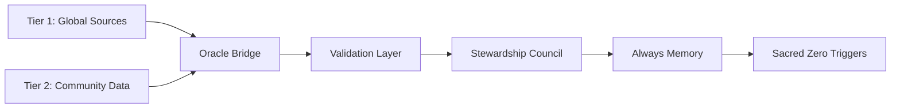

# Oracle Bridge: Earth Protection Data Integration

## Overview

The Oracle Bridge connects TML's Earth Protection framework with external ecological data sources through a decentralized oracle network. It ensures AI systems operate with current environmental baselines while validating community observations.

## Architecture

### Two-Tier Data System



### Oracle Network Structure

```yaml
network_composition:
  tier_1_nodes: 9       # Treaty/scientific data
  tier_2_nodes: 21      # Community validation
  bridge_nodes: 7       # Offline connectivity
  
consensus_requirements:
  tier_1: 5_of_9       # 56% agreement
  tier_2: 11_of_21     # 52% agreement
  emergency: 3_of_9    # Rapid response
```

## Data Sources

### Tier 1: Mandatory Global Sources

```python
MANDATORY_SOURCES = {
    "unfccc": {
        "endpoint": "https://unfccc.int/api/v2/treaties",
        "refresh": "daily",
        "validation": "cryptographic_signature"
    },
    "cbd": {
        "endpoint": "https://cbd.int/api/gbf/targets",
        "refresh": "weekly",
        "validation": "cryptographic_signature"
    },
    "ipcc": {
        "endpoint": "https://ipcc.ch/api/ar6/data",
        "refresh": "monthly",
        "validation": "hash_chain"
    },
    "iucn_redlist": {
        "endpoint": "https://iucnredlist.org/api/v4/species",
        "refresh": "monthly",
        "validation": "api_key"
    }
}
```

### Tier 2: Community Witness Data

```yaml
community_data:
  validation_requirements:
    minimum_witnesses: 3
    governance_approval: required
    oracle_verification: mandatory
    
  submission_methods:
    online: "Direct API"
    sms: "Structured codes"
    satellite: "Batch upload"
    usb_courier: "Monthly collection"
```

## Core Functions

### 1. Data Fetching

```python
async def fetch_ecological_data(source_id: str):
    """
    Retrieves latest environmental data from authoritative sources
    """
    # Get source configuration
    source = SOURCES[source_id]
    
    # Fetch with retry logic
    for attempt in range(3):
        try:
            data = await http_client.get(source.endpoint)
            
            # Validate authenticity
            if not validate_signature(data, source.public_key):
                raise SecurityException("Invalid signature")
            
            # Check version
            if data.version <= source.last_version:
                return None  # No update needed
            
            # Generate hash
            data_hash = sha256(data.content)
            
            # Log fetch in Always Memory
            await log_data_fetch(source_id, data.version, data_hash)
            
            return data
            
        except Exception as e:
            if attempt == 2:
                trigger_sacred_zero(f"Source unavailable: {source_id}")
```

### 2. Validation Consensus

```python
async def validate_with_consensus(data: Dict, tier: int):
    """
    Achieves oracle network consensus on data validity
    """
    if tier == 1:
        nodes = select_random_nodes(TIER_1_ORACLES, count=9)
        threshold = 5
    else:
        nodes = select_random_nodes(TIER_2_ORACLES, count=21)
        threshold = 11
    
    validations = []
    for node in nodes:
        result = await node.validate(data)
        validations.append(result)
    
    supporting = sum(1 for v in validations if v.valid)
    
    if supporting >= threshold:
        return ConsensusResult(valid=True, confidence=supporting/len(nodes))
    else:
        return ConsensusResult(valid=False, dissent=validations)
```

### 3. Change Detection

```python
def detect_protection_weakening(old_rules, new_rules):
    """
    Identifies if updates weaken environmental protection
    """
    weakening_indicators = []
    
    # Check carbon budgets
    if new_rules.carbon_budget > old_rules.carbon_budget:
        weakening_indicators.append("carbon_budget_increased")
    
    # Check species protection
    if len(new_rules.protected_species) < len(old_rules.protected_species):
        weakening_indicators.append("species_protection_reduced")
    
    # Check thresholds
    for threshold in ['water', 'soil', 'air']:
        if new_rules[threshold] > old_rules[threshold]:
            weakening_indicators.append(f"{threshold}_standard_relaxed")
    
    if weakening_indicators:
        trigger_sacred_zero("Protection weakening detected")
        alert_stewardship(weakening_indicators)
        require_scientific_review()
    
    return weakening_indicators
```

## Community Data Integration

### Offline-First Design

```yaml
offline_workflows:
  sms_bridge:
    format: "TML [TYPE] [SEVERITY] [LOCATION] [WITNESSES]"
    example: "TML WATER CRITICAL RIVER_NAME 5"
    gateway: "Regional SMS aggregators"
    
  satellite_sync:
    providers: ["Iridium", "Thuraya", "Globalstar"]
    frequency: "Daily burst transmission"
    compression: "zstd level 19"
    
  usb_courier:
    encryption: "AES-256-GCM"
    signature: "Ed25519"
    seal: "Tamper-evident physical"
    collection: "Monthly scheduled"
```

### Data Sovereignty

```python
class CommunityDataHandler:
    def __init__(self):
        self.sovereignty_rules = {
            "ownership": "community_permanent",
            "control": "community_absolute",
            "deletion": "community_initiated_only",
            "usage": "consent_required"
        }
    
    def process_observation(self, observation, community_id):
        # Verify consent
        if not self.verify_consent(community_id):
            return None
        
        # Validate governance approval
        if not self.check_governance_approval(observation):
            return None
        
        # Apply privacy protection
        observation = self.anonymize_if_requested(observation)
        
        # Never transfer ownership
        observation.owner = community_id
        observation.transferable = False
        
        return observation
```

## Security Model

### Multi-Layer Validation

1. **Source Authenticity**: Cryptographic signatures
2. **Version Control**: Hash chains and timestamps
3. **Oracle Consensus**: Byzantine fault tolerance
4. **Cross-Validation**: Multiple source correlation
5. **Community Verification**: Local knowledge check

### Attack Mitigation

```yaml
defenses:
  sybil_attack:
    - Stake requirements (1000 tokens minimum)
    - Hardware attestation required
    - Network diversity enforced
    - Reputation scoring active
    
  data_poisoning:
    - Multi-source validation
    - Historical consistency checks
    - Anomaly detection algorithms
    - Sacred Zero on suspicion
    
  oracle_collusion:
    - Random node selection (VRF)
    - Economic penalties (slashing)
    - Minority report system
    - Transparency logs public
```

## Performance Requirements

### Latency Targets

```yaml
operation_timing:
  tier_1_fetch: <500ms
  tier_2_validation: <1000ms
  consensus_achievement: <3000ms
  sacred_zero_trigger: <100ms
  
throughput:
  requests_per_second: 1000
  validations_per_second: 500
  peak_multiplier: 10x
```

### Availability

- Network uptime: 99.99% target
- Degraded mode: 60% nodes minimum
- Emergency mode: 30% nodes minimum
- Failover time: <30 seconds

## Economic Model

### Node Incentives

```yaml
rewards:
  per_validation:
    tier_1: $0.10*
    tier_2: $0.05*
    community: $0.02*
    
  accuracy_bonus:
    threshold: 95%
    multiplier: 1.5x
    
  uptime_payment:
    monthly: $50*
    requirement: 99.9%

penalties:
  false_data: -50%_stake
  downtime: -$10/hour*
  collusion: permanent_ban

*All amounts are nominal to 2025 USD
```

## Emergency Protocols

### Rapid Response Mode

```python
async def emergency_mode(crisis_type):
    if crisis_type in IMMEDIATE_THREATS:
        # Reduce consensus requirements
        consensus_threshold = 3  # of 9
        
        # Activate priority channels
        await activate_emergency_communication()
        
        # Pre-authorize resource allocation
        resources = pre_allocate_emergency_funds()
        
        # Document everything
        await always_memory.begin_emergency_log()
        
        return EmergencyResponse(
            mode="active",
            threshold="reduced",
            documentation="enhanced"
        )
```

## Integration Points

### With Always Memory

Every oracle operation logged:
```json
{
  "oracle_event": "data_fetch",
  "source": "ipcc_ar6",
  "version": "2023.03.20",
  "hash": "sha256:c5d6e7f8a9b0c1d2",
  "consensus": {
    "nodes": 9,
    "supporting": 7,
    "dissenting": 2
  },
  "timestamp": "2025-09-23T10:00:00Z",
  "changes_detected": ["carbon_budget_updated"]
}
```

### With Sacred Zero

Oracle bridge can trigger Sacred Zero for:
- Source unavailability
- Protection weakening detected
- Community critical alerts
- Consensus failure on critical data
- Version conflicts unresolved

### With Stewardship Council

- Daily update notifications
- Weakening detection alerts
- Emergency activation requests
- Consensus dispute escalation
- Community validation support

## Deployment Checklist

- [ ] All Tier 1 sources connected
- [ ] Oracle nodes staked and active
- [ ] Consensus mechanisms tested
- [ ] Community bridges operational
- [ ] Offline workflows documented
- [ ] Security measures verified
- [ ] Performance benchmarks met
- [ ] Emergency protocols tested
- [ ] Always Memory integration confirmed
- [ ] Stewardship notifications working

---

**Technical Note**: The oracle bridge is the immune system of Earth Protection—constantly checking, validating, and alerting when ecological boundaries are threatened.

---

**Creator**: Lev Goukassian (ORCID: 0009-0006-5966-1243)  
**Repository**: https://github.com/FractonicMind/TernaryMoralLogic

#### *"Sacred Zero is the moment code chooses geology over greed—500 ms that outlasts 500 years of erosion."*
