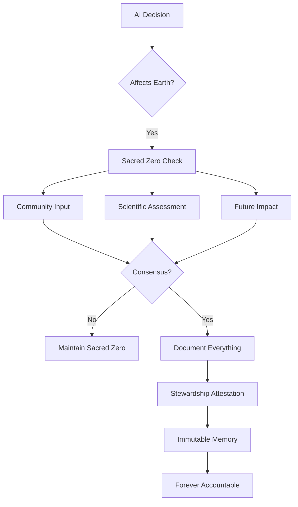

# Earth Protection: Core Principles

## Foundational Philosophy

### The Inseparability Principle

Human survival and Earth's health are not separate concerns—they are one concern. Every algorithm that degrades ecosystems ultimately degrades human possibility. Every Sacred Zero that protects Earth protects humanity's future.

### The Witness Principle

Earth cannot testify in court. Rivers cannot file lawsuits. Future generations cannot vote. Always Memory becomes their witness statement, creating evidence that speaks for those who cannot speak.

## Seven Sacred Principles

### 1. Irreversibility as Absolute Barrier

```yaml
principle: "What cannot be undone must not be done"
application:
  - Species extinction → Automatic refuse
  - Aquifer contamination → Sacred Zero minimum
  - Genetic pollution → Full stop required
  - Climate tipping points → Precautionary pause
rationale: "Extinction is forever. Some mistakes cannot be fixed."
```

### 2. Cumulative Harm Recognition

No single raindrop believes it causes the flood. TML tracks cumulative impacts:

```python
def cumulative_responsibility():
    # Every small decision adds up
    if action == "insignificant":
        track_anyway()  # Death by thousand cuts
    
    if sum(all_actions) > threshold:
        trigger_sacred_zero()  # Collective impact matters
```

### 3. Indigenous Wisdom Priority

Communities who have sustained ecosystems for millennia know things that satellites cannot see:

- Traditional indicators weighted equally to scientific data
- Seasonal patterns recognized across generations
- Sacred sites absolutely protected
- FPIC not negotiable, ever

### 4. Future Generations Standing

```yaml
representation_principle:
  current_humans: 8_billion_votes
  future_humans: infinite_weight
  
decision_framework:
  short_term_gain: discounted
  long_term_damage: amplified
  irreversible_harm: veto_power
```

### 5. Precautionary Default

When uncertain, protect. When conflicted, pause. When irreversible, refuse.

```python
def precautionary_principle(uncertainty_level):
    if uncertainty > 0.2:
        default = "sacred_zero"
    if irreversible_risk > 0:
        default = "refuse"
    
    # Never default to proceed when unsure
    return default
```

### 6. Nature's Intrinsic Rights

Ecosystems have value beyond human utility:

- Rivers have right to flow
- Forests have right to exist
- Species have right to evolution
- Soil has right to regeneration

This isn't romanticism—it's survival logic.

### 7. Transparency as Sacred Duty

```yaml
hidden_harm: "Criminal"
deleted_logs: "Fraud"
ignored_warnings: "Prosecutable"
suppressed_data: "Conspiracy"

transparency_requirement: "Absolute"
```

## Implementation Mandates

### Non-Negotiable Requirements

1. **No Greenwashing Exception**
   - Marketing claims ≠ Evidence
   - Intentions ≠ Impact
   - Promises ≠ Protection

2. **No Economic Override**
   - Profit never justifies extinction
   - Efficiency never excuses contamination
   - Growth never overrides limits

3. **No Sovereignty Violation**
   - Communities control their data
   - Indigenous rights are absolute
   - Local knowledge is authoritative

## The Accountability Cascade



## Burden of Proof

### Reversed Presumptions

Traditional: "Prove harm before stopping"  
TML: "Prove safety before proceeding"

Traditional: "Economic benefit justifies risk"  
TML: "Ecological health prerequisites economics"

Traditional: "Current gains discount future costs"  
TML: "Future costs prohibit current harm"

## Sacred Zero Triggers (Non-Exhaustive)

### Immediate Refusal
- Primary forest cutting
- Endangered species habitat destruction
- Sacred site violation
- Persistent toxin release

### Mandatory Pause
- Carbon budget approach
- Water table disruption
- Soil degradation acceleration
- Migration route interference

### Enhanced Monitoring
- Cumulative impact threshold
- Ecosystem service degradation
- Traditional indicator activation
- Community concern raised

## The Memory Mandate

Every ecological decision must answer:

```json
{
  "what_dies": "Species and ecosystems affected",
  "who_suffers": "Communities bearing the cost",
  "when_irreversible": "Point of no return",
  "why_chosen": "Reason for this path",
  "alternatives_rejected": "What else was possible",
  "debt_created": "What future must repair"
}
```

## Enforcement Philosophy

### Criminal, Not Civil

Environmental crimes are crimes against future humans:
- Missing logs = Negligence
- False logs = Fraud  
- Ignored triggers = Reckless endangerment
- Systematic violation = Organized crime

### Liability Cascade

```python
def assign_liability(harm):
    responsible = [
        "AI operator",
        "Algorithm developer",
        "Data selector",
        "Executive approver",
        "Board oversight"
    ]
    
    # No hiding behind algorithm
    return prosecute_all(responsible)
```

## Integration Requirements

### For AI Systems

1. Cannot disable Earth Protection
2. Cannot reduce trigger sensitivity
3. Cannot delete ecological logs
4. Cannot ignore community input
5. Cannot bypass future assessment

### For Corporations

1. Board attestation of compliance
2. Quarterly ecological audits
3. Public impact reporting
4. Community response documentation
5. Restoration fund contributions

### For Governments

1. Treaty compliance verification
2. Enforcement action records
3. Subsidy alignment review
4. Regulatory update speed
5. Public accountability metrics

## Success Metrics

### What We Measure

- Species saved from extinction
- Ecosystems protected from collapse
- Communities empowered to defend
- Future costs prevented
- Irreversible damage avoided

### What We Don't Count

- Economic growth at ecological cost
- Efficiency through externalization
- Innovation via contamination
- Progress through depletion

## The Long Memory

TML remembers what power wants forgotten:
- Every forest that fell to algorithms
- Every species lost to optimization
- Every community silenced by growth
- Every future mortgaged for quarterly earnings

These memories cannot be deleted, amended, or explained away.

## Closing Covenant

This framework exists because:
- The Earth cannot wait for human consensus
- The future cannot lobby today's legislators
- The dead cannot sue their killers
- The extinct cannot return

Sacred Zero gives Earth a voice that cannot be silenced, a memory that cannot be erased, and stewards that cannot be bought.

---

**Remember**: Every line of code that touches Earth's resources is writing history that great-grandchildren will read. Make it a history of protection, not plunder.

---

**Creator**: Lev Goukassian (ORCID: 0009-0006-5966-1243)  
**Repository**: https://github.com/FractonicMind/TernaryMoralLogic

*"The Earth does not need us. We need the Earth. Act accordingly."*
