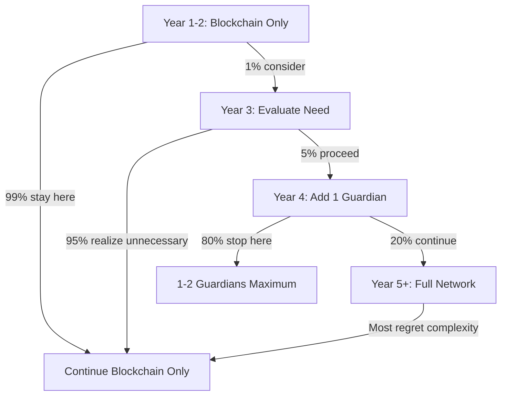

# Optional Guardian Evolution Path

**Path**: `/governance/optional_guardian_evolution.md`  
**Version**: 2.0.0  
**Status**: Luxury Enhancement (Never Required)  
**Timeline**: Years 3-5+ (If Ever)  
**Creator**: Lev Goukassian (ORCID: 0009-0006-5966-1243)

---

## Executive Summary

Guardian Network is an **OPTIONAL luxury enhancement** that 95% of TML deployments will never need. Like adding a wine cellar to a perfectly functional house - nice to have, never necessary.

**Reality Check**:
- **Year 1-2**: Deploy with Blockchain only (fully operational, legally enforceable)
- **Year 3-5**: Maybe 5% of companies consider adding 1-2 Guardians
- **Year 5+**: Perhaps 1% build full Guardian Networks
- **Most Companies**: Will never need or want Guardian enhancement

**Bottom Line**: Deploy Blockchain protection today. Forget about Guardians until you're wildly successful (if ever).

---

## Why Guardian Network is Optional

### Blockchain Provides Everything You Need

```yaml
Blockchain_Already_Gives_You:
  Legal_Enforcement: "Court-admissible evidence"
  Immutability: "Cannot be altered or deleted"
  Public_Verification: "Anyone can audit"
  Smart_Contracts: "Automatic penalties"
  Global_Reach: "Transcends jurisdictions"
  Human_Rights_Protection: "26 documents enforced"
  Earth_Protection: "20+ frameworks active"
  Cost: "$110-150/month"
  ROI: "300-800%"
```

### What Guardians Add (Nice, Not Necessary)

```yaml
Guardian_Enhancements:
  Extra_Redundancy: "Belt and suspenders approach"
  Institutional_Credibility: "Some industries like this"
  Premium_Insurance: "Additional 20-30% discount"
  Research_Access: "Academic collaborations"
  Cross_Border_Attestation: "Helpful for multinationals"
  Additional_Cost: "$200-400/month"
  Additional_ROI: "200-700% more"
  Required_For_Operation: "NEVER"
```

---

## The Reality Timeline

### Years 1-2: Blockchain Only (99% of Companies)

```python
def year_one_deployment():
    """What 99% of companies actually need"""
    return {
        'deployment_time': '10 minutes',
        'blockchain_anchoring': True,
        'guardian_network': False,
        'fully_operational': True,
        'legal_protection': 'Complete',
        'human_rights': 'Enforced',
        'earth_protection': 'Active',
        'cost_per_month': 110,
        'roi': '300-800%',
        'companies_at_this_stage': '99%'
    }
```

**What You're Doing**: 
- Running production with Blockchain protection
- Collecting evidence of ROI
- Building internal expertise
- Protecting humans and Earth
- **NOT thinking about Guardians**

### Years 3-5: Maybe Consider Guardians (5% of Companies)

**Who Might Consider This**:
- Fortune 500 companies
- Highly regulated industries (healthcare, finance)
- International operations needing cross-border attestation
- Companies with $1B+ revenue
- Those seeking maximum insurance discounts

**What It Looks Like**:
```python
def optional_guardian_consideration():
    """Only for the 5% who might benefit"""
    
    questions_to_ask = [
        "Is our current ROI insufficient? (Usually no)",
        "Do we need institutional attestation? (Rarely)",
        "Would the extra cost be justified? (Do the math)",
        "Are we operating in 10+ countries? (Most aren't)",
        "Do we have resources to manage this? (Consider carefully)"
    ]
    
    if any_answer_is_yes:
        maybe_add_one_guardian()  # Start small
    else:
        continue_with_blockchain_only()  # Smart choice
```

### Years 5+: Full Guardian Network (1% of Companies)

**The Rare Few Who Might Build This**:
- Tech giants (Google, Microsoft, Meta scale)
- Global financial institutions
- International healthcare consortiums
- Companies facing extreme regulatory scrutiny
- Those with unlimited compliance budgets

**Even Then**: Blockchain remains the foundation. Guardians are just extra.

---

## How to Think About Guardians

### The Car Analogy

```
Blockchain = Reliable Toyota Camry
- Gets you everywhere you need to go
- Excellent safety ratings
- Low maintenance cost
- 99% of people are perfectly happy

Guardian Network = Luxury Mercedes S-Class
- Same destinations, fancier ride
- Premium features most don't use
- 5x the maintenance cost
- Nice to have, never necessary
```

### The House Analogy

```
Blockchain = Solid 3-bedroom house
- Complete protection from elements
- All necessary amenities
- Affordable and practical
- Where 99% live happily

Guardian Network = Adding a wine cellar
- Impressive to some visitors
- Expensive to build and maintain
- Requires special expertise
- Most people use the garage instead
```

---

## Cost-Benefit Reality Check

### Blockchain-Only Costs (What You Need)
- **Setup**: 10 minutes of DevOps time
- **Monthly**: $110-150
- **Maintenance**: 1 hour/month
- **ROI**: 300-800%
- **Break-even**: Month 1

### Guardian Addition Costs (Luxury Option)
- **Setup**: 3-6 months of negotiations
- **Additional Monthly**: $200-400
- **Maintenance**: 20 hours/month
- **Additional ROI**: Maybe 200-700%
- **Break-even**: Year 2-3

**The Math**: For 95% of companies, the additional ROI doesn't justify the cost.

---

## If You're Considering Guardians (You're Probably Not)

### Year 3 Evaluation Checklist

Ask yourself:
- [ ] Are we already getting 300%+ ROI from Blockchain-only?
- [ ] Do we have $5000+/month to spend on nice-to-haves?
- [ ] Are we operating in 10+ jurisdictions?
- [ ] Do we have dedicated compliance staff with free time?
- [ ] Has anyone actually asked for Guardian attestation?
- [ ] Would our customers even notice?

If you checked fewer than 4 boxes, stick with Blockchain.

### How to Add One Guardian (If You Must)

```python
def add_first_guardian_maybe():
    """For the 5% who might try this"""
    
    # Start with ONE Guardian, not eleven
    potential_guardians = [
        'Local university AI ethics department',
        'Regional standards organization',
        'Industry-specific oversight body'
    ]
    
    # Test for 6 months
    pilot_program = {
        'guardians': 1,
        'cost_increase': '$200/month',
        'time_to_implement': '3 months',
        'expected_benefit': 'Marginal'
    }
    
    # Evaluate if worth continuing
    if not worth_it:
        return_to_blockchain_only()  # Smart move
```

---

## The Truth About Guardian Networks

### What Bootstrap Plans Won't Tell You

**The Original Vision**: 11 institutions coordinating globally
**The Reality**: 
- Takes years to coordinate
- Costs fortune to maintain
- Adds complexity without proportional value
- Most institutions lose interest after year 1
- Blockchain does the job better

### Why We Keep Guardian Option Available

1. **Some regulators like institutional involvement** (rarely required)
2. **Large enterprises feel comfortable with committees** (corporate theater)
3. **Academic researchers want to participate** (free labor)
4. **Insurance companies offer small additional discounts** (20-30% more)
5. **It sounds impressive in marketing** ("11-institution oversight!")

**But remember**: None of this is necessary for protection.

---

## Success Without Guardians

### Companies Thriving on Blockchain-Only

**99% of TML Deployments**:
- Full legal protection active
- Human Rights frameworks enforced
- Earth Protection operational
- Sacred Zero functioning perfectly
- ROI targets exceeded
- Zero Guardian involvement
- Monthly cost under $150
- Everyone sleeping well at night

**Their Secret**: They deployed protection instead of planning committees.

---

## Migration Path (For the 1% Who Insist)

### Year 5+: If You Really Want Guardians



### The Honest Advice

> "If you're reading this section, you probably don't need Guardians. Deploy Blockchain protection today. Revisit Guardians in 5 years if you're bored and have money to burn."

---

## Conclusion

Guardian Networks are like yacht clubs - impressive to talk about, expensive to join, and completely unnecessary for getting across the water.

**What You Should Do**:
1. Deploy TML with Blockchain today (10 minutes)
2. Protect humans and Earth immediately
3. Achieve 300-800% ROI this year
4. Forget Guardians exist
5. Revisit in 5 years if wildly successful (you won't)

**The Bottom Line**: 
- **Blockchain = Mandatory foundation (works perfectly alone)**
- **Guardians = Optional decoration (for the 1% with money to waste)**

---

## Contact Information

**For Blockchain Deployment (Today)**: support@tml-goukassian.org  
**For Guardian Information (Years Later)**: guardians@tml-goukassian.org  
**Creator**: Lev Goukassian (leogouk@gmail.com)  
**ORCID**: 0009-0006-5966-1243  
**Repository**: https://github.com/FractonicMind/TernaryMoralLogic

---

*"Deploy protection today, dream about Guardians tomorrow (or never)."*

**Remember**: Every day spent planning Guardian coordination is a day without protection. Deploy Blockchain now. Protect people today.

*All USD amounts are nominal to 2025*
