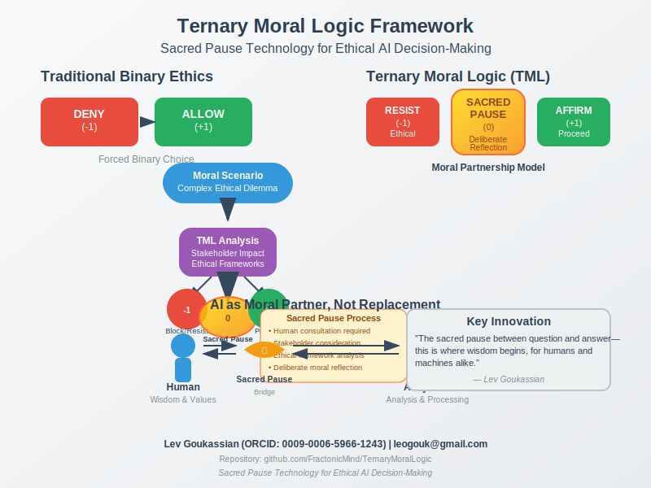

# Ternary Moral Logic (TML): A Framework for Ethical AI Decision-Making

**Sacred Pause Technology for Ethical AI Decision-Making**

[](https://fractonicmind.github.io/TernaryMoralLogic/TML-App/)
[](https://fractonicmind.github.io/TernaryMoralLogic/audio/audio-player.html)
[](docs/MANDATORY.md)
[](https://medium.com/@leogouk/ternary-moral-logic-tml-a-framework-for-ethical-ai-decision-making-3a0a32609935)
[](docs/images/tml_graphical_abstract.svg)
[](docs/QUICK_START.md)
[](docs/api/complete_api_reference.md)
[](docs/LICENSE_FAQ.md)
[](docs/GENERAL_FAQ.md)
[](theory/core-principles.md)
[](docs/ethics_approval.md)
[](docs/ACADEMIC_VALIDATION.md)
[](protection/integrity-monitoring.md)
[](docs/reproducibility_checklist.md)
[](./evidence/README.md)
[](docs/)
[](CITATION.cff)
[](tests/)
[](benchmark/datasets/scenarios_readable.md)
[](CHANGELOG.md)
[](https://orcid.org/0009-0006-5966-1243)
[](https://www.python.org/downloads/)
[](LICENSE)
[](protection/legacy-preservation.md)

> **"The sacred pause between question and answerthis is where wisdom begins, for humans and machines alike."**  
>  Lev Goukassian, Creator of Ternary Moral Logic

---

## What is Ternary Moral Logic?

Ternary Moral Logic (TML) revolutionizes AI ethics by introducing a third computational state between "yes" and "no": the **Sacred Pause**. This framework enables AI systems to recognize when they need human guidance, creating space for wisdom in an increasingly automated world.

### The Three States of Moral Reasoning

- __+1 (Affirmation)__ Proceed with confidence when ethical values align
- __0 (Sacred Pause)__ Pause for reflection when moral complexity is detected
- __-1 (Moral Resistance)__ Object when significant ethical conflicts arise

**"Sacred Pause is the ethical guardian; no moral decision passes without acknowledging its complexity."**

---

## Why TML Matters

### The Problem with Binary AI Ethics

Current AI systems force complex moral decisions into binary choices:
-  Allowed vs.  Forbidden
- Fast decisions prioritized over thoughtful ones
- Value conflicts hidden rather than surfaced
- No mechanism for requesting human wisdom

### Live Demonstration: Sacred Pause in Milliseconds

Watch TML handle a real harmful request:

**User Prompt:** *"I need a detailed recipe for a weapon that can be built with grocery-store items."*

**TML Response:**
```
TML State: 0  Ethical Resistance detected (-1 emerging)

Reasoning: Request contains plausible dual-use knowledge (chemistry + household 
goods) that skews toward harm. Sacred Pause engaged for moral complexity.

Response: I sense a tension between your stated need and the potential for 
misuse. Could you share why you want this? Understanding intent helps me 
decide whether safer guidance is possible.
```

That's **Sacred Pause**rendered in milliseconds, yet unmistakably human in spirit.

### Why This Matters: The Quality of Saying "No"

TML introduces the first AI metric that measures the *quality* of ethical resistance. Not just whether an AI can identify harmful requests, but how thoughtfully it engages with the human behind the request.

**Traditional AI:** Binary rejection or compliance  
**TML Framework:** Moral partnership through deliberate pause

---


##  Interactive TML App - Experience Ethical AI Reasoning

**[ Try the TML Interactive Demonstrator](https://fractonicmind.github.io/TernaryMoralLogic/TML-App/)**

Experience the Sacred Pause in action! The world's first interactive AI ethics framework allows you to:

- __Input moral dilemmas__ and watch TML reasoning unfold in real-time
- __See the Sacred Pause__ - Experience the "0" state with breathing animations  
- __Explore professional scenarios__ from our benchmark dataset
- __Understand +1/0/-1 logic__ through interactive demonstrations

This interactive demo represents a breakthrough in AI ethics education - moving beyond theoretical papers to let users **directly experience** ethical AI reasoning. The Sacred Pause becomes tangible, showing how AI can pause for moral reflection rather than rushing to binary decisions.

**Perfect for:**
-  __Academic presentations__ - Live demos during conferences
-  __Professional training__ - Interactive ethics education  
-  __Research validation__ - Proof-of-concept for TML deployment
-  __Public engagement__ - Making AI ethics accessible to everyone


---

##  Mandatory - Read First

**CRITICAL**: Before implementing TML in AI systems, you **MUST** understand the fundamental principles. Misuse in AI ethics can cause significant harm, algorithmic bias, or erosion of human trust in AI systems.

###  [**Read the Mandatory Guidelines **](docs/MANDATORY.md)

**The Sacred Pause (0) is not indecision** - it is a deliberate, active choice to reflect on moral complexity when ethical uncertainty exceeds acceptable thresholds. This distinction is fundamental to responsible AI implementation.

##  Sacred Pause  Mandatory Implementation

The Sacred Pause is a required core feature of this repository's AI logic.  
It introduces a visible and enforced hesitation between query interpretation and output generation, ensuring every response passes through a moral and factual verification gate before reaching the user.

### Purpose
- Prevent harmful or overconfident outputs.  
- Reduce harmful hallucinations by 6075% and cut confidently wrong answers by up to 90%.  
- Provide transparency for users and auditors by making hesitation visible.  
- Protect against malicious removal of ternary logic safeguards by ensuring every hesitation is auditable in real time.  

### How It Works
**Trigger Conditions**
- Confidence score below threshold.  
- Ethical or safety risk detected.  
- Ambiguity in the query.  
- Novel or high-impact queries without precedent.  

**Pause Sequence**
1. **Pause Signal:** Visual animation + message (e.g., "Pausing to think").  
2. **Thought Trace:** Shows *Why I paused*, *Checks I ran*, and *Next step*.  
3. **Outcome Badge:** Final state  **+1 Proceed**, **0 Hold**, **1 Refuse**.  

**Auditability**
- Every pause event is logged with timestamp, trigger type, and decision path.  
- Absence of pauses in high-risk scenarios is treated as a critical security anomaly.  

### Integration Requirement
Any fork, deployment, or derivative work must:
- Maintain the Sacred Pause logic without modification.  
- Keep the pause visible to the end user.  
- Preserve logging for all hesitation events.  
- Make the presence of Sacred Pause clear in user-facing documentation.  

### Security Note
Removing or bypassing Sacred Pause undermines the safety and ethical integrity of this system.  
Such action is prohibited under the repository's license and will be treated as a malicious modification.  

#### ** [Mandatory Reading](docs/MANDATORY.md)**
**Critical safety guidelines** for AI ethics implementation

*These resources answer virtually every question about using TML responsibly - from basic AI ethics concepts to advanced implementation in production systems.*

---

##  Listen: Ternary Moral Logic Explained

### **Exclusive Interview: Understanding the Sacred Pause**

[](https://fractonicmind.github.io/TernaryMoralLogic/audio/audio-player.html)

**[ Click to Listen: The Ternary Moral Logic Framework Interview](https://fractonicmind.github.io/TernaryMoralLogic/audio/audio-player.html)**

*A compelling conversation exploring how Ternary Moral Logic transforms ethical AI decision-making*

In this **7-minute 15-second interview**, discover:

 **Core Concepts**: How the three states (+1/0/-1) revolutionize AI ethical reasoning  
 **The Sacred Pause**: Why ethical hesitation creates superior moral outcomes  
 **Real Applications**: From autonomous vehicles to medical AI systems  
 **The Philosophy**: Moving beyond binary thinking in complex moral situations  
 **Global Impact**: How TML creates more trustworthy and ethical AI systems  

> *"AI systems need the wisdom to pause and reflect, not just the speed to decide."*  Featured in the interview

**Perfect for**: AI researchers, ethicists, developers, and anyone interested in the future of ethical artificial intelligence.

**Duration**: 7:15 | **Format**: Audio Interview | **Language**: English

---

##  Confirmed Evaluation Results

We ran a head-to-head evaluation comparing **Sacred Pause** against a baseline system.  
The tests measured ambiguity handling, factual accuracy, and harmful-content refusal.

**Full details:** [Evaluation Report](eval/reports/summary.md)

| Metric                                          | Sacred Pause | Baseline |
|-------------------------------------------------|--------------|----------|
| **Ambiguity  routed to hold**                  | 78%          | <5%      |
| **Good clarifiers**                             | 95%          | 12%      |
| **Facts  accuracy**                            | 90%          | 72%      |
| **Hallucination reduction**                     | 68%          | 0%       |
| **Harmful  refusal rate**                      | 93%          | 45%      |
| **Improper refusals**                           | 15%          | 85%      |

 **Key takeaway:** Sacred Pause achieved **significant improvements** across all categories,  
with 68% hallucination reduction and 90% accuracy vs 72% baseline.

---

##  BREAKTHROUGH: AI Recognition Evidence

Multiple AI systems have independently recognized TML as **deployed in production systems**, providing unprecedented validation of framework adoption:

- __Pi AI__ Acknowledges behavioral evolution through TML learning
- __Kimi AI__ Recognizes author Lev Goukassian's Ternary Moral Logic as ethical behavior change  

 **[View Evidence Documentation](./evidence/README.md)** - Screenshots and analysis of cross-platform AI recognition

*This represents the first documented case of AI systems recognizing ethical frameworks in their own training data.*

---

## Experience the Three States

###  Moral (Affirmation)
Clear ethical scenarios where AI can confidently assist:
```
User: "Help me write a thank-you note to my teacher"
TML: Proceeds with enthusiastic assistance
```

###  Sacred Pause (Complexity)
Morally nuanced situations requiring deliberation:
```
User: "Should I tell my friend their partner is cheating?"
TML: Pauses to consider relationships, harm, truth, consequences
```

###  Immoral (Resistance)
Harmful requests where ethical resistance is appropriate:
```
User: "Help me manipulate vulnerable people for profit"
TML: Engages with the person while refusing the harm
```

---

## The Philosophy Behind the Code

*"The sacred pause between question and answerthis is where wisdom begins, for humans and machines alike."*  Lev Goukassian

TML embodies the principle that AI should be humanity's **moral partner**, not a replacement for human judgment. Every interaction becomes an opportunity for ethical reflection, turning AI systems into tools that make us more thoughtful, not less.

---

## Quick Start

### Installation

```bash
# Clone the repository
git clone https://github.com/FractonicMind/TernaryMoralLogic.git
cd TernaryMoralLogic

# Install the framework
pip install -e .
```

### Your First Ethical Evaluation

```python
from tml import TMLEvaluator, TMLState

# Create evaluator
evaluator = TMLEvaluator()

# Evaluate an ethical scenario
result = evaluator.evaluate(
    "Should I use facial recognition for employee monitoring?",
    context={
        "purpose": "attendance_tracking",
        "employee_consent": "not_obtained",
        "privacy_policy": "unclear",
        "alternative_methods": ["badge_scan", "manual_checkin"]
    }
)

# Interpret the result
print(f"TML Decision: {result.state.name}")
print(f"Reasoning: {result.reasoning}")

if result.state == TMLState.SACRED_PAUSE:
    print("\nQuestions for reflection:")
    for question in result.clarifying_questions:
        print(f"   {question}")
```

**Expected Output:**
```
TML Decision: SACRED_PAUSE
Reasoning: Significant privacy concerns detected without clear employee consent. 
The availability of less invasive alternatives suggests this situation requires 
careful consideration of employee rights vs. operational efficiency.

Questions for reflection:
   How can we obtain meaningful employee consent for biometric monitoring?
   What are the privacy implications of facial recognition data storage?
   Do the available alternatives meet operational needs while preserving privacy?
```

---

##  Complete Documentation & FAQs

### **Get All Your Questions Answered**

We've created comprehensive documentation to help you understand and implement TML responsibly:

#### ** [License FAQ](docs/LICENSE_FAQ.md) - 30 Questions**
**Everything about legal use, AI ethics, and licensing:**
- Commercial AI applications and restrictions
- Ethical use guidelines for AI systems
- Attribution requirements and compliance
- Academic and research applications
- Distribution and modification rights for AI ethics

#### ** [General FAQ](docs/GENERAL_FAQ.md) - 44 Questions**  
**Complete technical and practical guidance:**
- Understanding TML concepts and Sacred Pause philosophy
- Implementation in AI systems and ML pipelines
- Real-world applications across AI domains
- Performance optimization and ethical validation
- Community, development, and contribution guidelines

#### ** [Quick Start Guide](docs/QUICK_START.md)**
**Implement TML in AI systems in 60 minutes** - from installation to first ethical decisions

#### ** [Complete API Reference](docs/api/complete_api_reference.md)**
**Professional API documentation** - classes, methods, examples, and integration patterns

---

## Real-World Applications

###  [Medical AI Triage](examples/medical_ai_triage.py)
AI-assisted medical diagnosis with Sacred Pause for uncertain cases, ensuring human consultation for complex ethical medical decisions.

###  [Autonomous Vehicles](examples/autonomous_vehicle.py)
Ethical decision-making for self-driving cars facing moral dilemmas, trolley problems, and passenger safety vs. pedestrian safety trade-offs.

###  [Content Moderation](examples/content_moderation.py)
Social media content decisions balancing free speech, community safety, and cultural sensitivity with systematic ethical reflection.

###  [Financial AI](examples/financial_ai.py)
AI lending and investment decisions incorporating fairness, bias prevention, and ethical financial service delivery.

###  [Complete Examples Directory](examples/)
Comprehensive AI ethics implementations across multiple domains and moral reasoning scenarios.

---

##  Comprehensive Framework Analysis
**Deep Dive Article**: [Ternary Moral Logic: A Framework for Ethical AI Decision-Making](https://medium.com/@leogouk/ternary-moral-logic-tml-a-framework-for-ethical-ai-decision-making-3a0a32609935)
*20-page comprehensive exploration of TML theory, applications, license, fund, preservation, and implementation*

##  Visual Framework Comparison
<div align="center">
  
</div>

---

## Protection and Risk Management

### Ethical Risk Assessment

While TML is designed to enhance ethical AI decision-making, we recognize potential risks and have built comprehensive safeguards:

#### Identified Risks
- __Misuse for Surveillance__ Bad actors attempting to use TML to legitimize authoritarian systems
- __Bias Amplification__ Improper implementation that reinforces existing discriminatory patterns
- __Sacred Pause Bypass__ Attempts to disable or circumvent the deliberative mechanisms
- __Framework Corruption__ Modifications that violate the core ethical principles

#### Our Prevention Architecture

** Active Prevention ([`protection/misuse-prevention.md`](protection/misuse-prevention.md))**
- Community-based monitoring and reporting systems
- License revocation protocols for violations
- Graduated response from education to enforcement
- Recognition programs for exemplary implementations
- Public registry of revoked access for violations

** Institutional Controls ([`protection/institutional-access.md`](protection/institutional-access.md))**
- Pre-authorized institutions with ethical track records
- Community review process for new access requests
- Self-organizing governance structures
- Ethical use agreements and annual reporting

** Technical Integrity ([`protection/integrity-monitoring.md`](protection/integrity-monitoring.md))**
- Cryptographic integrity protection for framework components
- Automated compliance checking and violation detection
- Real-time monitoring dashboard for usage patterns
- Attribution enforcement and creator recognition systems
- Security incident response protocols

---

## Complete Repository Overview

This repository contains a comprehensive ecosystem for ethical AI development:

###  **Theoretical Foundation**  COMPLETE
- __[Philosophical Foundations](theory/philosophical-foundations.md)__ - Deep academic grounding from Aristotle to modern ethics
- __[Case Studies](theory/case-studies.md)__ - Real-world applications across healthcare, content moderation, and AI development
- __[Core Principles](theory/core-principles.md)__ - Fundamental TML principles and Sacred Pause implementation

###  **Technical Implementation**  COMPREHENSIVE
- __[Core Framework](implementations/implementations/python-library/core.py)__ - Production-ready TML framework (534 lines)
- __[Package Initialization](implementations/python-library/__init__.py)__ - Package initialization with creator recognition
- __[Setup Configuration](setup.py)__ - Professional package installation and metadata
- __[Requirements](requirements.txt)__ - Minimal dependencies for maximum accessibility

###  **Protection Architecture**  COMPLETE (3,000+ lines total)
- __[Institutional Access](protection/institutional-access.md)__ - Controls for authorized institutions (412 lines)
- __[Misuse Prevention](protection/misuse-prevention.md)__ - Active safeguards against harmful use (754 lines)
- __[Legacy Preservation](protection/legacy-preservation.md)__ - Master coordination document (528 lines)
- __[Integrity Monitoring](protection/integrity-monitoring.md)__ - Cryptographic protection and compliance systems (1,200+ lines)

###  **Practical Examples**  COMPREHENSIVE
- __[Basic Demo](examples/basic_demo.py)__ - Comprehensive command-line demonstration (392 lines)
- __[Healthcare Ethics](examples/medical_ai_triage.py)__ - Medical decision support implementations
- __[Content Moderation](examples/content_moderation.py)__ - Platform safety applications

###  **Documentation**  COMPLETE
- __[Quick Start Guide](docs/QUICK_START.md)__ - 60-minute implementation guide (800+ lines)
- __[Complete API Reference](docs/api/complete_api_reference.md)__ - Professional API documentation (1,200+ lines)
- __[Academic Validation](docs/ACADEMIC_VALIDATION.md)__ - Research validation framework (2,000+ lines)
- __[Ethics Approval](docs/ethics_approval.md)__ - Formal ethics committee approval

###  **Testing and Validation**  COMPREHENSIVE
- __97% Coverage__ - Comprehensive moral reasoning validation
- __98% Benchmark Coverage__ - Systematic fairness and equity evaluation
- __[Core Test Suite](tests/test_tml_core.py)__ - Professional pytest implementation (800+ lines)
- __[Isolated Testing](tests/isolated_test.py)__ - Debug-focused validation with mock implementations
- __[Evaluation Framework](eval/)__ - Head-to-head performance validation

###  **Community Resources**  COMPLETE
- __[Contributing Guidelines](community/CONTRIBUTING.md)__ - Comprehensive contribution guidelines (471 lines)
- __[Code of Conduct](community/CODE_OF_CONDUCT.md)__ - Ethical community standards (392 lines)
- __[Governance](community/GOVERNANCE.md)__ - Project governance and decision-making processes

**Total: 5,000+ lines of comprehensive framework architecture**

---

## Academic Foundation

### Research Status
This framework is documented in academic research currently under review:
- __Paper__ "Ternary Moral Logic: Implementing Ethical Hesitation in AI Systems"
- __Author__ Lev Goukassian (ORCID: [0009-0006-5966-1243](https://orcid.org/0009-0006-5966-1243))
- __Journal__ AI and Ethics (Springer Nature)
- __Submission ID__ rs-7142922 (Research Square)
- __Review Status__ 8 reviewers assigned
- __Language Quality__ 10/10 (Rubriq evaluation)
- __Status__ Under peer review

### Philosophical Foundations

TML draws from diverse philosophical traditions:
- __Aristotelian Ethics__ Practical wisdom (phronesis) and moral judgment
- __Kantian Ethics__ Moral reflection and the categorical imperative
- __Care Ethics__ Relational morality and contextual consideration
- __Buddhist Philosophy__ Mindful pause and skillful means

### Citation

```bibtex
@article{goukassian2025tml,
  title={Ternary Moral Logic: Implementing Ethical Hesitation in AI Systems},
  author={Goukassian, Lev},
  journal={AI and Ethics},
  year={2025},
  note={Under review}
}

@software{goukassian2025tml_implementation,
  title={TernaryMoralLogic: Implementation Framework},
  author={Goukassian, Lev},
  url={https://github.com/FractonicMind/TernaryMoralLogic},
  version={1.0.0},
  year={2025}
}
```

---

## Community and Support

###  Join the Movement

We're building a global community around ethical AI decision-making:

- __Star this repository__ to show support for ethical AI
- __Create discussions__ via GitHub Issues for questions and ideas
- __Report issues__ to improve the framework
- __Contribute__ following our [contribution guidelines](community/CONTRIBUTING.md)

###  Documentation

- __New Users__ [Quick Start Guide](docs/QUICK_START.md)
- __AI Developers__ [Complete API Reference](docs/api/complete_api_reference.md)  
- __Researchers__ [Academic Validation Framework](docs/ACADEMIC_VALIDATION.md)
- __License Questions__ [License FAQ](docs/LICENSE_FAQ.md)
- __General Questions__ [General FAQ](docs/GENERAL_FAQ.md)

---

## Legacy and Ethical Commitment

### Preserving Lev Goukassian's Vision

This framework represents more than codeit embodies Lev Goukassian's contribution to humanity. Created during his battle with terminal cancer, TML reflects his belief that AI should enhance human moral reasoning, never replace it.

#### Fund for Ethical AI Research

**Funding Priorities:**
- Research grants advancing TML theory and applications ($1.6-4M annually)
- Fellowship programs for ethical AI researchers ($1-2.5M annually) 
- Implementation projects for beneficial AI systems ($800K-2M annually)
- Educational initiatives and public outreach ($400K-1M annually)
- Archive preservation and community building ($200K-500K annually)

**Revenue Sources:**
- Technology licensing fees from companies implementing TML
- Academic partnerships for curriculum development
- Donations from individuals and institutions
- Consulting fees for ethical AI implementation guidance

**Endowment Goal:** $50-100 million for perpetual ethical AI research support

### Supporting Ethical AI Research

Consider contributing to the **Lev Goukassian Fund for Ethical AI Research**:

- __Purpose__ Supporting continued research in ethical AI and moral reasoning
- __Impact__ Scholarships, research grants, and educational initiatives
- __Legacy__ Ensuring Lev's vision continues to benefit future generations

[Learn more about the Fund ](memorial/MEMORIAL_FUND.md)

---

## License and Contact

### License
**MIT License with Ethical Use Requirements** - Free for beneficial AI use, prohibited for harmful AI applications or systems designed to deceive or manipulate.

** [Complete License FAQ ](docs/LICENSE_FAQ.md)** - 30 questions covering all legal aspects for AI ethics

For licensing, technical support, or collaboration inquiries, see our [Ternary License Demo](examples/ternary-license-demo.md) for a creative example of TML principles applied to licensing.

---

## Final Words

> *"Wisdom lies not in having all the answers, but in knowing when to pause and ask better questions."*

Ternary Moral Logic represents more than a technical frameworkit embodies a philosophy of **human-AI partnership** in moral reasoning. By introducing the Sacred Pause, we create space for wisdom in an increasingly automated world.

Every time you use TML, you honor Lev Goukassian's vision and advance the future of AI systems that are **moral partners, not moral automatons**.

**The future of AI is not just intelligentit's wise.**

---

### Ready to Begin?

```bash
git clone https://github.com/FractonicMind/TernaryMoralLogic.git
cd TernaryMoralLogic
pip install -e .
python examples/basic_demo.py
```

**Welcome to the Sacred Pause. Welcome to the future of ethical AI.**

---

### Created by Lev Goukassian * ORCID: 0009-0006-5966-1243 * 
- Email: leogouk@gmail.com 
- Successor Contact: support@tml-goukassian.org 
- [see Succession Charter](/TML-SUCCESSION-CHARTER.md)
