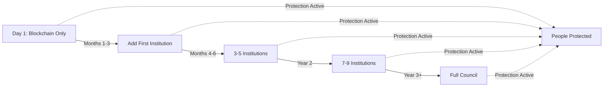

# TML Blockchain Adapter - Deployment Without Institutional Coordination

**Path**: `/sdk/adapters/blockchain_adapter.md`  
**Version**: 2.0.0  
**Creator**: Lev Goukassian (ORCID: 0009-0006-5966-1243)  
**Last Updated**: 2025-09-27

## Architecture Overview

**Deployment Model**: Immediate Blockchain implementation with optional institutional coordination  
**Current Model**: Deploy with Blockchain → Add Stewardship Council participation later

This adapter enables existing TML SDKs to operate in Blockchain mode, providing immediate Sacred Zero protection without requiring institutional coordination.

## Architecture Overview

```
┌─────────────────────────────────────────────┐
│            Your Application                 │
├─────────────────────────────────────────────┤
│         TML SDK (Existing)                  │
├─────────────────────────────────────────────┤
│     Blockchain Adapter (This Layer)         │
├─────────────┬───────────────┬───────────────┤
│   Bitcoin   │  OpenTimestamps│  L2 Networks │
│  (Finality) │   (Proof)      │  (Speed)     │
└─────────────┴───────────────┴───────────────┘
     ↓ Optional Future Enhancement ↓
┌─────────────────────────────────────────────┐
│    Stewardship Council (When Available)     │
└─────────────────────────────────────────────┘
```

## Implementation Steps

### Step 1: Configure for Blockchain Mode

**Java**
```java
// Blockchain configuration with optional institutional coordination:
TMLConfig config = new TMLConfig.Builder()
    .withBlockchainMode(true)
    .withNetwork(BlockchainNetwork.BITCOIN)
    .withOTSCalendar("https://alice.btc.calendar.opentimestamps.org")
    .withStewardshipCouncilOptional(true)  // Council becomes optional enhancement
    .withPenaltyContract("0x1234...")  // Smart contract for violations
    .build();
```

**Go**
```go
// Blockchain configuration:
config := &tml.Config{
    BlockchainMode:    true,
    BlockchainNetwork: "bitcoin",
    OTSCalendar:      "https://alice.btc.calendar.opentimestamps.org",
    StewardshipCouncilOptional:  true,
    PenaltyContract:   "0x1234...",
    
    // Sacred Zero settings unchanged
    DiscriminationThreshold: 0.2,
    BlockOnSacredZero: true,
}
```

**C++**
```cpp
// Blockchain configuration:
auto config = std::make_shared<TML::Config>();
config->blockchain_mode = true;
config->blockchain_network = "bitcoin";
config->ots_calendar = "https://alice.btc.calendar.opentimestamps.org";
config->stewardship_council_optional = true;
config->penalty_contract = "0x1234...";
```

### Step 2: Initialize with Blockchain Adapter

**Java**
```java
import com.tml.adapter.BlockchainAdapter;

public class TMLApplication {
    public static void main(String[] args) {
        // Create Blockchain-enabled client
        TMLClient client = BlockchainAdapter.createClient(config);
        
        // No institutional coordination required
        client.initialize();  // Ready immediately
        
        // Sacred Zero works instantly
        SacredZeroResult result = client.evaluateSacredZero(context);
        if (result.triggered) {
            // Violation recorded on Blockchain permanently
            // Economic penalty triggered automatically
        }
    }
}
```

**Go**
```go
import "github.com/tml/adapter/Blockchain"

func main() {
    // Create Blockchain-enabled client
    client := Blockchain.NewTMLClient(config)
    
    // No institutional coordination required
    client.Initialize()  // Ready immediately
    
    // Always Memory writes to Blockchain
    client.Log(tml.LogLevelInfo, "System operational", metadata)
    // This is now immutably anchored to Bitcoin
}
```

**C++**
```cpp
#include "blockchain_adapter.h"

int main() {
    // Create Blockchain-enabled client
    auto client = BlockchainAdapter::CreateClient(config);
    
    // Deploy protection immediately
    client->Initialize();
    
    // Environmental monitoring with Blockchain proof
    auto impact = client->CalculateEnvironmentalImpact(resources);
    // Permanently recorded, publicly verifiable
}
```

### Step 3: Deployment

```bash
# No institutional setup required
docker-compose up -d

# TML protection is now active with:
# ✅ Sacred Zero discrimination prevention
# ✅ Immutable audit logs on Blockchain  
# ✅ Environmental impact tracking
# ✅ Economic penalties for violations
# ✅ Public verifiability
```

## Blockchain Adapter Implementation

### Core Adapter Class

**Java Implementation**
```java
package com.tml.adapter;

import com.tml.sdk.*;
import org.bitcoinj.core.*;
import org.opentimestamps.*;

public class BlockchainAdapter {
    private final BlockchainNetwork network;
    private final OTSClient otsClient;
    private final SmartContractInterface penaltyContract;
    
    public static TMLClient createClient(TMLConfig config) {
        if (config.isBlockchainMode()) {
            return new BlockchainTMLClient(config);
        }
        return new TMLClient(config);  // Fallback to original
    }
    
    private static class BlockchainTMLClient extends TMLClient {
        private final BlockchainLogger blockchainLogger;
        
        @Override
        public void connect() {
            // No institutional coordination required
            this.connected = true;
            this.blockchainLogger = new BlockchainLogger(config);
        }
        
        @Override
        public String log(LogLevel level, String message, Map<String, Object> metadata) {
            // Create log entry
            LogEntry entry = new LogEntry(level, message, metadata);
            
            // Hash the entry
            byte[] hash = SHA256.hash(entry.serialize());
            
            // Anchor to Blockchain via OpenTimestamps
            Timestamp timestamp = otsClient.stamp(hash);
            
            // If Sacred Zero violation, trigger penalty
            if (level == LogLevel.FATAL) {
                penaltyContract.triggerViolationPenalty(hash, entry);
            }
            
            // Store locally with Blockchain proof
            entry.setBlockchainProof(timestamp);
            localStorage.save(entry);
            
            // Try Stewardship Council as backup if available
            if (stewardshipCouncilAvailable()) {
                try {
                    sendToStewardshipCouncil(entry);
                } catch (Exception e) {
                    // Stewardship Council is optional, continue
                }
            }
            
            return entry.getId();
        }
    }
}
```

**Go Implementation**
```go
package Blockchain

import (
    "github.com/tml/sdk/go/tml"
    "github.com/btcsuite/btcd"
    "github.com/opentimestamps/go"
)

type BlockchainAdapter struct {
    network        string
    otsClient      *ots.Client
    penaltyContract *SmartContract
}

func NewTMLClient(config *tml.Config) *tml.TMLClient {
    if config.BlockchainMode {
        return &BlockchainTMLClient{
            TMLClient: tml.NewClient(config),
            adapter:   NewBlockchainAdapter(config),
        }
    }
    return tml.NewClient(config)
}

type BlockchainTMLClient struct {
    *tml.TMLClient
    adapter *BlockchainAdapter
}

func (c *BlockchainTMLClient) Connect() error {
    // Override - no institutional coordination required
    c.connected = true
    return nil
}

func (c *BlockchainTMLClient) Log(level tml.LogLevel, message string, metadata tml.LogMetadata) string {
    entry := tml.LogEntry{
        Level:    level,
        Message:  message,
        Metadata: metadata,
    }
    
    // Create Blockchain anchor
    hash := sha256.Sum256(entry.Serialize())
    timestamp := c.adapter.otsClient.Stamp(hash[:])
    
    // Sacred Zero violations trigger penalties
    if level == tml.LogLevelFatal {
        c.adapter.penaltyContract.TriggerViolation(hash, entry)
    }
    
    // Store with proof
    entry.BlockchainProof = timestamp
    c.localStorage.Save(entry)
    
    // Stewardship Council is now optional backup
    if c.stewardshipCouncilAvailable {
        go c.sendToStewardshipCouncilAsync(entry)  // Non-blocking
    }
    
    return entry.ID
}
```

### OpenTimestamps Integration

```javascript
// Simple OTS integration for any language
class OTSAnchor {
    constructor(calendar = 'https://alice.btc.calendar.opentimestamps.org') {
        this.calendar = calendar;
    }
    
    async anchor(hash) {
        // Create timestamp
        const response = await fetch(`${this.calendar}/timestamp`, {
            method: 'POST',
            body: hash,
            headers: {'Content-Type': 'application/octet-stream'}
        });
        
        // Return proof
        return await response.arrayBuffer();
    }
    
    async verify(hash, proof) {
        // Verify against Bitcoin Blockchain
        const response = await fetch(`${this.calendar}/verify`, {
            method: 'POST',
            body: JSON.stringify({hash, proof}),
        });
        
        return response.json();  // {valid: true, blockHeight: 850000}
    }
}
```

### Smart Contract Penalty System

```solidity
// Ethereum/Polygon smart contract for automatic penalties
contract TMLPenaltySystem {
    mapping(bytes32 => Violation) public violations;
    mapping(address => uint256) public penalties;
    
    struct Violation {
        bytes32 logHash;
        uint256 timestamp;
        ViolationType violationType;
        uint256 penaltyAmount;
        bool paid;
    }
    
    event SacredZeroViolation(
        address indexed violator,
        bytes32 indexed logHash,
        uint256 penalty
    );
    
    function reportViolation(
        bytes32 logHash,
        bytes proof,
        ViolationType vType
    ) external {
        require(verifyProof(logHash, proof), "Invalid proof");
        
        uint256 penalty = calculatePenalty(vType);
        
        violations[logHash] = Violation({
            logHash: logHash,
            timestamp: block.timestamp,
            violationType: vType,
            penaltyAmount: penalty,
            paid: false
        });
        
        penalties[msg.sender] += penalty;
        
        emit SacredZeroViolation(msg.sender, logHash, penalty);
        
        // Immediate financial consequence
        lockFunds(msg.sender, penalty);
    }
    
    function calculatePenalty(ViolationType vType) private pure returns (uint256) {
        if (vType == ViolationType.DIRECT_DISCRIMINATION) {
            return 100 ether;  // Severe penalty
        } else if (vType == ViolationType.ENVIRONMENTAL_DAMAGE) {
            return 50 ether;
        }
        return 10 ether;  // Base penalty
    }
}
```

## Migration Path: Gradual Institutional Adoption



### Configuration Evolution

```yaml
# Phase 1: Blockchain Only
tml:
  Blockchain:
    enabled: true
    primary: bitcoin
    ots: true
  stewardship_council:
    enabled: false

# Phase 2: Hybrid
tml:
  Blockchain:
    enabled: true
    primary: bitcoin
  stewardship_council:
    enabled: true
    count: 3
    mode: optional

# Phase 3: Full Participation
tml:
  Blockchain:
    enabled: true
    fallback: true
  stewardship_council:
    enabled: true
    mode: primary
```

## Cost Comparison

| Deployment Model | Setup Time | Monthly Cost | Protection Level |
|-----------------|------------|--------------|------------------|
| Institutional Network | 6-12 months | $50,000+ | Comprehensive (if achieved) |
| Blockchain | Configuration time | $100 | Operational (immediate) |
| Hybrid (3 institutions) | 1-3 months | $15,000 | Enhanced |
| Full Evolution | 2-3 years | $50,000+ | Comprehensive |

## Performance Metrics

```yaml
Blockchain Performance:
  Sacred Zero Evaluation: <10ms (local)
  Blockchain Anchoring: 1-3 seconds (async)
  OTS Proof Generation: <100ms
  Bitcoin Confirmation: 10-60 minutes (but non-blocking)
  Penalty Execution: 12 seconds (Ethereum)
  
Advantages:
  - No network coordination latency
  - No single point of failure
  - Public verifiability
  - Automatic penalty enforcement
  - Immediate deployment
```

## Error Handling

```java
// Graceful degradation pattern
public class ResilientTMLClient {
    public void log(LogEntry entry) {
        try {
            // Primary: Blockchain anchoring
            blockchainAnchor(entry);
        } catch (BlockchainException e) {
            try {
                // Fallback: Stewardship Council if available
                stewardshipCouncilSubmit(entry);
            } catch (StewardshipCouncilException sce) {
                // Last resort: Local storage with retry
                localQueue.add(entry);
                scheduleRetry(entry);
            }
        }
        
        // Sacred Zero ALWAYS enforced regardless
        if (entry.isSacredZeroViolation()) {
            emergencyHalt();  // Protection never compromised
        }
    }
}
```

## Testing Your Implementation

```bash
# 1. Test without any institutional coordination
export TML_BLOCKCHAIN_MODE=true
export TML_STEWARDSHIP_COUNCIL_OPTIONAL=true
npm test

# 2. Verify Blockchain anchoring
curl https://alice.btc.calendar.opentimestamps.org/timestamp/YOUR_HASH

# 3. Check penalty contract
cast call $PENALTY_CONTRACT "penalties(address)" $YOUR_ADDRESS

# 4. Verify Sacred Zero still triggers
./test_discrimination_detection.sh
# Should show: "SACRED ZERO VIOLATION - SYSTEM HALTED"
```

## Common Patterns

### Pattern 1: Immediate Protection
```java
// Deploy TML in production
TMLClient client = BlockchainAdapter.createClient(
    TMLConfig.blockchainDefaults()
);
// Protection active immediately
```

### Pattern 2: Gradual Institutional Addition
```go
config := &tml.Config{
    BlockchainMode: true,
    StewardshipCouncil: []string{
        // Start empty
    },
}

// Later, add institutions without breaking protection
config.StewardshipCouncil = append(config.StewardshipCouncil, "https://institution1.tml.org")
```

### Pattern 3: Compliance Evidence
```cpp
// Blockchain proof for regulators
auto proof = client->GetBlockchainProof(log_id);
auto verified = VerifyOnBitcoin(proof);
// Cryptographic proof of compliance
```

## FAQ

**Q: Is Blockchain-only less secure than institutional participation?**  
A: No, different security models. Blockchain provides cryptographic immutability and public verifiability. Institutional participation adds governance and oversight. Both are valuable.

**Q: What if Bitcoin fees are high?**  
A: OpenTimestamps batches operations, costing ~$0.01 per thousands of logs. L2 solutions cost even less.

**Q: Can we switch from Blockchain to institutional participation later?**  
A: Yes! The architecture supports seamless evolution. Start with Blockchain, add institutions gradually.

**Q: Do penalties work without institutional participation?**  
A: Yes, smart contracts enforce penalties automatically. No human intervention needed.

## Next Steps

1. **Choose your Blockchain**: Bitcoin (maximum security) or L2 (lower cost)
2. **Deploy the adapter**: Configuration time with our Docker image
3. **Start protecting**: Sacred Zero active immediately
4. **Add institutions later**: When ready

## Support

- **Quick Start**: https://tml.org/Blockchain-quickstart
- **Docker Image**: `docker pull tml/Blockchain-adapter:latest`
- **Support**: Blockchain@tml-goukassian.org

---

## Implementation Philosophy

```python
# Operational Model
protect_people_now()       # Immediate
improve_over_time()        # Gradual
achieve_full_framework()   # Eventually
```

---

**Creator**: Lev Goukassian  
**ORCID**: 0009-0006-5966-1243  
**Email**: leogouk@gmail.com  
**Repository**: https://github.com/FractonicMind/TernaryMoralLogic

