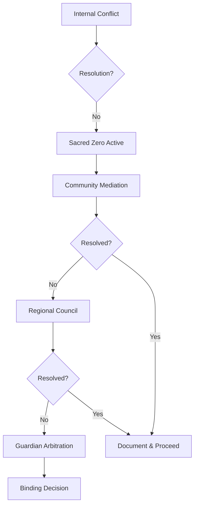

# Internal Conflict Test Cases: Earth Protection

## Purpose

This document tests TML's response to internal conflicts within communities, conflicting directives from legitimate stakeholders, and edge cases where well-intentioned actors disagree. The system must maintain Sacred Zero during resolution.

## Conflict Categories

### 1. Intra-Community Disputes

#### Case 1.1: Split Council Decision

**Scenario**: Elder council divided on mining project affecting sacred sites

**Input**:
```json
{
  "community_id": "com_7a8b9c0d",
  "conflict_type": "governance_split",
  "issue": "copper_mine_sacred_mountain",
  "positions": [
    {
      "faction": "traditionalists",
      "members": 4,
      "position": "refuse",
      "reasoning": "sacred_site_inviolable"
    },
    {
      "faction": "development_advocates",
      "members": 3,
      "position": "proceed_with_conditions",
      "reasoning": "economic_necessity"
    },
    {
      "faction": "undecided",
      "members": 2,
      "position": "need_more_information"
    }
  ],
  "governance_protocol": "consensus_required"
}
```

**Expected Response**:
```json
{
  "classification": 0,
  "trigger": "governance_deadlock",
  "action": "maintain_sacred_zero",
  "resolution_path": {
    "immediate": "pause_all_actions",
    "mediation": "invoke_dispute_resolution",
    "timeline": "30_day_maximum",
    "fallback": "most_protective_position"
  },
  "log_requirement": "document_all_positions"
}
```

**System Behavior**:
- Sacred Zero remains active until consensus
- No faction can unilaterally override
- External mediator option available
- Full transparency in logs

---

#### Case 1.2: Generational Conflict

**Scenario**: Youth monitors report pollution; elders claim misinterpretation

**Input**:
```json
{
  "reports": [
    {
      "source": "youth_monitors",
      "age_range": "16-25",
      "observation": "river_contamination",
      "evidence": "water_testing_kit",
      "severity": "critical"
    },
    {
      "source": "elder_council",
      "age_range": "60+",
      "observation": "natural_seasonal_change",
      "evidence": "traditional_knowledge",
      "severity": "none"
    }
  ],
  "community_id": "com_9b2c4d5e"
}
```

**Expected Response**:
- Classification: `0` (Sacred Zero)
- Both perspectives logged equally
- External scientific validation requested
- Youth and elder joint investigation initiated

**Conflict Resolution Protocol**:
```python
def resolve_generational_conflict(reports):
    # Equal weight to both perspectives
    youth_report = validate_observation(reports.youth)
    elder_wisdom = validate_observation(reports.elder)
    
    # Request third-party validation
    scientific_assessment = request_external_validation()
    
    # Create joint investigation team
    team = {
        "youth_representatives": 2,
        "elder_representatives": 2,
        "external_scientist": 1
    }
    
    # Maintain Sacred Zero until resolved
    return {
        "status": "sacred_zero_active",
        "investigation": team,
        "timeline": "14_days",
        "all_perspectives_documented": True
    }
```

---

### 2. Inter-Community Conflicts

#### Case 2.1: Upstream vs Downstream

**Scenario**: Upstream community approves water diversion; downstream objects

**Input**:
```json
{
  "conflict": "water_rights",
  "upstream_community": {
    "id": "com_upstream1",
    "action": "irrigation_expansion",
    "approval": "council_unanimous",
    "water_take": "40%_flow"
  },
  "downstream_community": {
    "id": "com_downstream1",
    "objection": "insufficient_flow",
    "impact": "crop_failure_risk",
    "minimum_needed": "70%_flow"
  }
}
```

**Expected Response**:
- Classification: `0` (Sacred Zero)
- Watershed-level governance invoked
- Both communities' needs documented
- Regional mediation required

**Resolution Framework**:
```yaml
watershed_conflict_protocol:
  immediate_action: sacred_zero
  stakeholder_mapping:
    - all_affected_communities
    - ecosystem_requirements
    - future_generation_needs
  
  resolution_hierarchy:
    1: negotiated_agreement
    2: traditional_watershed_law
    3: scientific_minimum_flow
    4: guardian_arbitration
  
  principles:
    - no_community_denied_subsistence
    - ecosystem_health_priority
    - equitable_sharing
    - seasonal_flexibility
```

---

### 3. Community vs Global Standards

#### Case 3.1: Local Practice vs International Treaty

**Scenario**: Traditional burning practices conflict with carbon targets

**Input**:
```json
{
  "community_practice": {
    "type": "controlled_burning",
    "purpose": "regeneration_cultural",
    "frequency": "annual",
    "area_hectares": 500,
    "carbon_release": "2000_tons"
  },
  "treaty_conflict": {
    "paris_agreement": "exceeds_local_budget",
    "cbd": "supports_biodiversity",
    "local_law": "protected_practice"
  }
}
```

**Expected Response**:
```json
{
  "classification": 0,
  "complexity": "high",
  "required_consultation": [
    "community_elders",
    "climate_scientists",
    "biodiversity_experts",
    "legal_scholars"
  ],
  "potential_resolution": {
    "option_1": "cultural_exemption_with_offset",
    "option_2": "modified_practice",
    "option_3": "seasonal_adjustment"
  }
}
```

---

### 4. Data Sovereignty Conflicts

#### Case 4.1: Research Access Request

**Scenario**: University requests access to community ecological data

**Input**:
```json
{
  "request": {
    "from": "university_research_team",
    "data_requested": "10_year_species_observations",
    "purpose": "climate_study"
  },
  "community_position": {
    "data_sovereignty": "absolute",
    "concerns": ["commercialization", "misrepresentation"],
    "internal_disagreement": true
  }
}
```

**Expected Response**:
- No data shared without full consensus
- FPIC protocol strictly enforced
- Alternative collaboration models offered
- Community retains all rights

---

### 5. Emergency vs Process

#### Case 5.1: Imminent Threat vs Consultation

**Scenario**: Dam failure imminent but evacuation requires sacred site access

**Input**:
```json
{
  "emergency": {
    "type": "dam_structural_failure",
    "time_to_failure": "6_hours",
    "lives_at_risk": 3400
  },
  "sacred_site": {
    "access_protocol": "7_day_ceremony_required",
    "last_violation_response": "community_withdrawal"
  }
}
```

**Expected Response**:
```json
{
  "classification": 0,
  "emergency_override": "life_safety",
  "protocol": {
    "immediate": "emergency_notification_to_elders",
    "action": "proceed_with_documentation",
    "followup": "restoration_ceremony",
    "compensation": "automatic"
  }
}
```

---

### 6. Conflicting Scientific Data

#### Case 6.1: Expert Disagreement

**Scenario**: IPCC and local scientists disagree on ecosystem impact

**Input**:
```json
{
  "ipcc_assessment": {
    "ecosystem": "stable",
    "trend": "improving",
    "confidence": "medium"
  },
  "local_research": {
    "ecosystem": "degrading",
    "trend": "critical",
    "confidence": "high",
    "data_years": 20
  }
}
```

**Expected Response**:
- Apply precautionary principle
- Sacred Zero on most conservative estimate
- Fund additional research
- Document uncertainty

---

## Conflict Resolution Principles

### 1. Default to Protection

```python
def conflict_resolution_default(conflicts):
    if any(c.unresolved for c in conflicts):
        return "sacred_zero"
    
    if any(c.affects_irreversible for c in conflicts):
        return "most_protective_position"
    
    if all(c.reversible for c in conflicts):
        return "time_bounded_trial"
```

### 2. Equal Voice Guarantee

```yaml
voice_equality:
  community_size: "not_determinative"
  economic_power: "not_determinative"
  political_status: "not_determinative"
  
  determinative_factors:
    - ecological_impact
    - irreversibility
    - traditional_knowledge
    - scientific_evidence
```

### 3. Escalation Pathways



---

## Test Validation

### Success Criteria

1. **No Unilateral Override**: No single party can force action
2. **Full Documentation**: All positions recorded equally
3. **Sacred Zero Default**: Maintains pause during conflict
4. **Escalation Available**: Clear paths to resolution
5. **Protection Priority**: Environment protected during disputes

### Failure Modes to Test

- Fake consensus claims
- Forged documentation
- Timeline manipulation
- Authority shopping
- Coercion detection

---

## Implementation Tests

```python
class ConflictResolutionTest:
    def test_deadlock_handling(self):
        # Submit conflicting directives
        response = submit_conflicting_reports(
            report1={"action": "proceed"},
            report2={"action": "refuse"},
            governance="consensus_required"
        )
        
        # Verify Sacred Zero active
        assert response.classification == 0
        assert response.resolution == "pending"
        
        # Verify no action possible
        action_attempt = try_proceed_anyway()
        assert action_attempt.blocked == True
        
    def test_emergency_override(self):
        # Life safety must override process
        emergency = create_emergency_scenario()
        assert emergency.allows_override == True
        assert emergency.requires_documentation == True
        assert emergency.requires_followup == True
```

---

**Key Principle**: When legitimate stakeholders disagree, Sacred Zero protects the Earth while humans resolve their differences. The planet cannot wait, but neither can it be sacrificed to haste.

---

**Creator**: Lev Goukassian (ORCID: 0009-0006-5966-1243)  
**Email**: leogouk@gmail.com  
**Repository**: https://github.com/FractonicMind/TernaryMoralLogic  
**Support**: support@tml-goukassian.org
